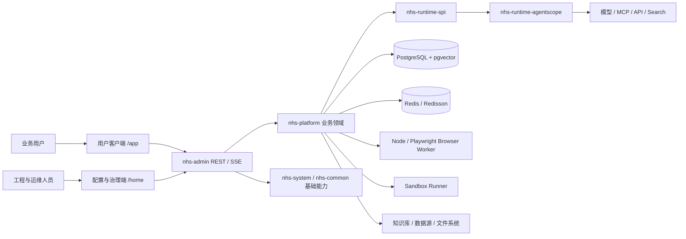

# nhs

[**中文**](README.md) | [English](README_EN.md)

`nhs` 是基于 Java 21 与 AgentScope Java 构建的企业级通用智能体平台工程实践，围绕任务驱动、数字员工、工作空间与业务接入四个核心域，将系统划分为控制面、运行时、执行面与治理面：控制面负责 Agent、模型、Skill、MCP、知识与数据资源的声明式配置和版本化发布；运行时承载多 Agent 协作、上下文编排、工具路由与事件流；执行面通过 Browser 与 Sandbox 提供类 RPA 的受控操作环境和隔离计算能力；治理面统一接入身份、权限、审批、风控、审计与用量计量。平台支持多垂类 Agent 的能力装配与相互通信，目标是将模型推理转化为可授权、可执行、可观测、可验收、可追溯的企业级数字生产力。

> 文档状态：2026-08-27 项目快照。当前仓库适合作为后续续建、拆分或重构的业务与工程参考，不应直接视为已经完成生产验收的发布版本。

## 1. 项目定位

`nhs` 不是单纯的聊天页面，也不是只供研发人员使用的 Agent 配置工具。产品按使用人群拆成三个相互关联、权限隔离的工作面：


| 工作面   | 主要用户                 | 入口                                       | 核心目标                                   |
| ----- | -------------------- | ---------------------------------------- | -------------------------------------- |
| 用户客户端 | 普通业务用户、项目成员          | `/app`，兼容别名 `/client`                    | 用对话、任务和项目完成日常工作，不暴露底层工程配置              |
| 配置管理端 | Agent 工程师、数据工程师、平台运维 | `/home` 及动态授权菜单                          | 配置 Agent、模型、Skill、MCP、知识库、数据源、自动化和开放能力 |
| 治理运营端 | 管理人员、安全人员、审计人员       | `/dashboard`、`/risk-control`、`/system` 等 | 查看运行情况、Token 消耗、权限、风险、审批、审计和平台健康度      |


平台目前采用“单企业私有化”边界，不额外引入产品级多租户模型。不同用户、项目、任务和资源之间仍通过主体、角色、权限包、访问策略与数据范围进行隔离。

## 2. 当前业务状态

当前代码已经从基础框架扩展为覆盖面较广的智能体平台工程原型，核心领域、主要页面、数据库迁移和运行时适配均已形成。它具有继续开发和按模块复用的价值，但当前代码版本尚未作为一个完整候选版本重新做全量验收。

理解项目状态时需要区分三个层次：


| 层次     | 当前结论                                                         |
| ------ | ------------------------------------------------------------ |
| 历史联调结果 | 登录、私有会话、任务、Agent 调用、流式响应等核心链路曾完成阶段性联调，相关结果只能证明当时版本           |
| 当前源码实现 | 用户端、配置端、治理端及后端主要业务域均有源码实现，数据库迁移已推进至 `V99`                    |
| 生产可用状态 | 尚不能据此判定为生产就绪；仍需从空库迁移、真实供应商接入、跨用户权限、浏览器与 Sandbox、性能安全和私有化交付验证 |


> **完整产品规划**
>
> 本 README 主要记录当前实现情况，产品完整形态、16 个产品域及详细功能定义请参阅 [`企业级智能体工作平台功能模块规划.md`](doc/企业级智能体工作平台功能模块规划.md)。

## 3. 产品界面

以下截图记录当前产品实现，原图统一归档在 [`doc/screenshots/`](doc/screenshots/README.md)。

### 用户客户端

#### 智能对话工作台

以项目和历史会话组织上下文，主区域聚焦对话内容与输入，支持自动路由、指定 Agent、文件与执行工具。


#### 任务状态看板

按任务状态形成可拖动看板，并提供搜索、状态筛选、排序、视图切换和快速创建入口。


#### 重要/紧急四象限

根据重要性和紧急度排列任务，帮助用户区分优先处理、计划推进、快速处理和按序安排的工作。


#### 项目中心

集中展示项目状态、关联任务、默认智能体和协作空间，为会话与任务提供长期项目上下文。


### 配置管理端

#### 管理工作台

汇总个人待办、Token、技能、MCP、任务和数据入口，并通过推荐场景与最近任务连接日常配置和运营工作。


#### Agent 创建向导

通过基本信息、角色与指令、引擎与运行、能力装配、体验与发布五个步骤完成智能体配置，降低专业参数的理解成本。


#### 模型配置

以类型化表单配置 Provider、服务地址、凭证、模型能力、上下文长度和推理参数，并提供模型发现与连接测试。


#### MCP 连接器

按步骤配置服务地址、传输协议、命名空间、鉴权方式和超时策略，并在接入前完成连接验证与工具发现。


#### 知识库

统一管理知识库、文档、可见范围和检索能力，并提供跨库检索、A/B 检索与运营指标入口。


#### 数据接入

围绕数据源、数据集与元数据、只读查询三个层次管理企业数据连接，支持托管凭证、连接测试和启停控制。


### 治理运营端

#### 风控中心

将审批工作台、审计日志、通知收件箱和风险策略放在同一治理入口，集中处理高风险执行和人工确认。


#### 开放接口与 Embed

提供 API 应用、服务账号、Playground、接口文档和 Embed 调试能力，支持将已发布 Agent 安全嵌入外部业务系统。


#### 成员与权限

在成员详情中统一查看并配置权限包、个人覆盖、临时授权和参考用户复制，兼顾授权效率与变更留痕。


#### Token 统计

按时间范围统计输入、输出和交互次数，展示智能体与用户消耗排行，并保留逐次调用明细。


## 4. 核心业务闭环

平台以“完成可验收的工作”为主线，而不是以模型返回一段文本为终点。

```text
登录 / 身份识别
  -> 私有会话或显式创建任务
  -> 绑定项目与任务上下文
  -> 冻结 Agent、资源和权限快照
  -> 运行时执行（当前适配 AgentScope）
  -> 调用工具 / MCP / 知识库 / 数据源 / Sandbox / Browser
  -> 在高风险节点发起审批、确认或用户追问
  -> 生成消息、文件、报表等制品
  -> 用户验收或退回重做
  -> 留存通知、审计、Trace 和用量统计
```

核心对象的职责边界如下：

- **会话**：默认属于用户私域，用于低门槛交互、上下文延续和结果展示。
- **项目**：组织成员、任务、默认 Agent、文件与运行策略，是长期协作上下文。
- **任务**：企业共享和协作的正式工作单元，拥有目标、优先级、状态、版本和验收结果。
- **执行**：一次具体运行，拥有独立运行状态、事件时间线、资源快照、消耗和错误信息；任务状态与运行状态不混用。
- **制品**：执行产生的文件、查询结果、图表、报告或其他可交付结果。
- **验收**：由业务用户确认完成、驳回或要求重做。模型声称“已完成”不等于任务闭环。
- **审批与审计**：对敏感工具、数据访问和关键操作进行人工控制，并记录可追溯证据。

## 5. 业务模块

### 5.1 用户客户端

用户客户端采用独立全屏布局，默认进入 `/app`。它刻意隐藏大部分平台工程配置，只保留业务用户高频使用的三个入口。


| 模块   | 已有能力                                                                                            |
| ---- | ----------------------------------------------------------------------------------------------- |
| 智能对话 | 项目与会话分组、会话搜索、历史记录、自动路由、`@Agent`、指定 Agent、流式消息、执行事件、用户确认与追问、引用内容、图表、代码、SQL 计划、Mermaid、工作区文件和制品预览 |
| 任务中心 | 名称与条件筛选、列表视图、状态看板、重要/紧急四象限、新建任务、单 Agent 或固定多 Agent 编排、资源授权、运行详情、版本快照、步骤、制品和验收记录                 |
| 项目中心 | 卡片与列表视图、项目搜索、新建与编辑、默认 Agent、项目成员、关联任务、工作区和隔离策略                                                  |


客户端与管理端共用登录态和后端权限体系。只有拥有管理端路由权限的账号，才应看到并使用工作区切换入口。

### 5.2 配置管理端

配置管理端基于 SoybeanAdmin 标准布局，通过后端动态路由控制账号实际可见菜单。主要面向专业人员，而不是普通业务用户。


| 模块       | 路由                                                       | 已有能力                                                               |
| -------- | -------------------------------------------------------- | ------------------------------------------------------------------ |
| 管理工作台    | `/home`                                                  | 待办、常用 Agent、推荐场景、最近任务和数据入口                                         |
| 协作工作区    | `/workspace`                                             | 管理端智能对话、工作区文件与浏览器控制                                                |
| 任务与项目运营  | `/task-center`、`/project-center`                         | 企业任务运行和验收、项目成员与角色、文件、网络及通知策略                                       |
| Agent 中心 | `/agent-center`                                          | 向导式创建、系统提示词、模型与运行策略、Skill/工具/知识库装配、欢迎体验、版本发布、执行历史与 Trace           |
| Agent 调试 | `/agent-debug`                                           | 调试运行、实时事件、重放、审批状态和浏览器控制                                            |
| 资源中心     | `/resource-center`                                       | 模型、MCP/Search/API 连接器、工具、Skill、记忆；包含连接测试、工具发现、ZIP Skill 导入、版本与发布审核 |
| 知识库      | `/knowledge`                                             | 目录、权限、文档、解析、切片、Embedding、检索策略、指标和检索实验                              |
| 数据接入     | `/data-source`                                           | 数据源、数据集、元数据目录、字段与指标、画像、表关系、行策略、导入导出和只读查询                           |
| 自动化      | `/automation`                                            | 手动、Cron、Webhook 触发，绑定固定任务版本和服务账号，配置重试策略                            |
| 开放接口     | `/open-api`                                              | API 应用、服务账号、机器身份授权、凭证、接口文档、Playground、Embed 和迁移归档                  |
| 提示词与场景   | `/prompt-studio`、`/scenario-templates`、`/slash-commands` | 提示词版本与变量测试、场景模板交付、个人快捷命令                                           |


配置体验遵循“表单、向导和分步选择优先”的原则。原始 JSON 只应作为系统内部传输或高级诊断数据存在，不应要求普通配置人员手工编写未知结构的 JSON。

### 5.3 治理与运营


| 模块           | 路由                           | 已有能力                                                     |
| ------------ | ---------------------------- | -------------------------------------------------------- |
| 风控中心         | `/risk-control`              | 审批工作台、审计日志、通知收件箱和风险策略                                    |
| 身份与系统管理      | `/system`                    | 成员、固定角色、权限包、权限复制历史、身份同步、Token 额度、运行健康、Redis 运维、日志留存和平台配置 |
| 运营看板         | `/dashboard`、`/token-stats`  | 执行成功率、Token/API 使用趋势、Agent 健康、用户与 Agent 排行和调用明细          |
| 数据门户与 ChatBI | `/data-portal`、`/chatbi`     | 数据目录、自然语言分析、只读 SQL、图表与透视、历史、简报、监控和下钻                     |
| 报表与案例        | `/saved-reports`、`/examples` | 报表定义、参数化运行、订阅、运行历史和 ChatBI 案例治理                          |
| 个人与记忆        | `/personal-center`、`/memory` | 个人资料、有效权限、额度、通知、个人资源、会话摘要、长期偏好和记忆运维                      |


此外，前端保留 `/embed/chat` 嵌入式对话与 `/client/debug` Widget 协议调试能力，用于将平台能力集成进第三方业务系统。

## 6. 总体架构



### 6.1 前端

- Vue 3、TypeScript、Vite 8、Naive UI、UnoCSS。
- 以 SoybeanAdmin 作为管理端基座，保留其认证、动态路由、布局和工程工具链。
- `/app` 使用独立客户端布局；`/home` 及其他管理页面使用标准后台布局。
- 页面候选路由在前端生成，最终菜单与可访问范围由后端权限结果决定，不能只依赖“隐藏菜单”做安全控制。
- 查询和配置采用 REST，长时间执行与对话增量结果采用 SSE/事件流展示。

### 6.2 后端模块


| Maven 模块                    | 职责                                          |
| --------------------------- | ------------------------------------------- |
| `nhs-admin`                 | Spring Boot 应用入口、环境配置和模块装配                  |
| `nhs-platform`              | Agent、会话、项目、任务、执行、资源、知识、数据、审批、审计、开放接口等平台业务域 |
| `nhs-runtime-spi`           | 与具体智能体引擎无关的运行时契约                            |
| `nhs-runtime-agentscope`    | AgentScope Java 运行时适配器                      |
| `nhs-sandbox-runner`        | 面向不可信或高隔离执行的独立 Runner                       |
| `nhs-migration-cli`         | 迁移清点、转换与验证辅助工具                              |
| `nhs-system`、`nhs-common-*` | 继承基础框架的用户、权限、Web、MyBatis、Redis、日志、加密等通用能力   |
| `nhs-api`、`nhs-extend`      | 公共 API 契约及监控、任务等可选扩展服务                      |


`nhs-platform` 内部按业务域组织代码，主要包括 `agent`、`conversation`、`project`、`task`、`execution`、`workflow`、`model`、`connector`、`skill`、`knowledge`、`memory`、`data`、`approval`、`artifact`、`automation`、`notification`、`identity`、`iam`、`openapi`、`embed`、`audit`、`risk`、`browser`、`sandbox`、`report`、`scenario`、`operations` 和 `portal`。

### 6.3 运行时与隔离执行

- 项目已抽取 `nhs-runtime-spi`，AgentScope 通过适配模块接入，为未来增加运行引擎提供依赖边界；当前仍存在 AgentScope 专属语义和恢复协议，替换能力尚未验证。
- AgentScope 适配器是条件启用组件。接手时必须核对实际运行 Profile 与 `NHS_RUNTIME_AGENTSCOPE_ENABLED`，不能仅凭 Maven 依赖存在就判断运行时已经启用。
- Agent 发布后形成版本；任务运行时冻结 Agent、模型、工具、Skill、知识与权限快照，避免配置变化破坏历史可解释性。
- Browser Worker 是独立 Node/Playwright 进程。Java 主进程只调用其 HTTP API，不在 JVM 中执行不可信浏览器代码；浏览器上下文只保存在 Worker 内存中，Worker 重启后必须失效旧会话并重新打开。
- Sandbox Runner 承担代码与 Skill 依赖等隔离执行，避免主应用直接暴露宿主环境。
- 高风险工具、浏览器接管、敏感数据操作和 Agent 主动提问通过可持久化的等待/恢复状态衔接人工操作。

### 6.4 数据与基础设施

- PostgreSQL 16+ 是业务持久化事实源，`pgvector` 用于向量数据；Redis/Redisson 只承担缓存、锁和短期协调，不作为最终业务事实源。
- 平台 SQL 位于 `backend/script/sql/postgres/agent/`。当前迁移头为 `V99`，共有 98 个迁移脚本，`V58` 为预留版本。该目录内的旧版说明仍停留在 `V94`，续建时应以实际迁移文件和本节为准并同步修正文档。
- 已发布的迁移脚本应保持不可变，后续修改通过新增版本演进。
- 数据模型尽量避免复杂外键和跨业务域级联耦合，优先使用唯一约束、状态机、事务、版本号和应用层校验；当前迁移中存在少量必要外键，不能假设数据库为“零外键”。
- 平台按单企业私有部署设计，不在核心平台表中再复制一套产品级租户模型。
- 密钥、数据库密码、模型 API Key 和连接器凭证必须加密存储或保存安全引用，不能出现在种子 SQL、前端回显、日志或截图中。

## 7. 设计理念

1. **业务闭环优先**：对话只是入口，任务、执行、制品和验收共同定义“工作完成”。
2. **使用人群分层**：普通用户只面对对话、任务和项目；复杂资源配置进入管理端；运营与安全信息进入治理端。
3. **人类可理解的配置**：模型、API、MCP、Search、Skill、知识和数据源使用类型化表单或向导，避免让用户直接填写无说明的 JSON。
4. **配置与运行分离**：可变配置形成不可变发布版本，执行引用冻结快照，支持审计、回放和问题定位。
5. **最小权限与默认拒绝**：显式拒绝优先；私有会话和企业共享任务属于不同可见域；后端必须再次执行资源级授权判断。
6. **身份类型分离**：人类用户、服务账号和 API 应用是不同主体，凭证、授权范围和审计记录不混用。
7. **运行引擎解耦演进**：已通过 SPI 建立依赖边界，后续仍需继续收敛 AgentScope 专属语义并验证第二种运行引擎。
8. **持久化事实可追溯**：关键状态、审批、事件、快照、消耗和结果进入 PostgreSQL，缓存丢失不应改变最终业务结论。
9. **不可信执行隔离**：浏览器、代码、第三方 Skill 和外部连接器按风险分区运行，并保留租约、超时、确认和审计机制。
10. **私有化交付可运维**：设计需覆盖离线安装、配置加密、健康检查、备份恢复、升级和回滚，而不仅是开发环境启动。

## 8. 权限与共享模型

平台权限不是单一“角色菜单”模型，而是多个层次共同决定：

```text
登录主体
  -> 固定角色 / 权限包 / 直接授权
  -> 路由与操作权限
  -> 项目成员关系和任务访问规则
  -> Agent 与资源授权快照
  -> 数据目录、知识目录、连接器和工具的细粒度策略
  -> 风险策略、审批与审计
```

主要约束：

- 私有会话默认仅会话所有者可见，不因同属一个企业而自动共享。
- 项目和任务可按成员、角色和访问规则共享；任务运行只能使用当次已授权并冻结的资源。
- `deny` 规则优先于 `allow`，不存在授权时默认拒绝。
- 菜单权限只决定入口可见性，接口和数据访问仍由后端校验。
- 权限复制面向“参考用户选择”，不是让管理员手工输入用户 ID；复制行为本身需要留痕。
- 服务账号用于自动化和机器调用，不应伪装成人类用户，也不应拥有不可解释的全局权限。

## 9. 开源许可

后端基于 [RuoYi-Vue-Plus](https://github.com/dromara/RuoYi-Vue-Plus)，前端基于 [SoybeanAdmin](https://github.com/soybeanjs/soybean-admin)，两个项目均采用 MIT License，许可证文件分别保留在 `backend/LICENSE` 和 `frontend/LICENSE`。

> 后续计划：考虑到 AI 智能体领域的 Java 生态仍相对受限，项目后续将以全新的 Python 项目形态重新设计并开源，本仓库继续作为现有业务实现与架构设计的参考保留。
