# Niuhuoshan Enterprise Agent Platform

[中文](README.md) | **English**

Niuhuoshan Enterprise Agent Platform (internal codename: `nhs`) is an engineering implementation of a general-purpose enterprise Agent platform built on Java 21 and AgentScope Java. Centered on four core domains - task-driven execution, digital employees, workspaces, and business integration - the system is organized into a control plane, runtime plane, execution plane, and governance plane. The control plane provides declarative configuration and versioned publication for Agents, models, Skills, MCP services, knowledge, and data resources; the runtime plane handles multi-Agent collaboration, context orchestration, tool routing, and event streams; the execution plane delivers RPA-like controlled operations and isolated computing through Browser and Sandbox environments; and the governance plane unifies identity, authorization, approval, risk control, auditing, and usage metering. By supporting capability composition and direct collaboration across domain-specific Agents, the platform aims to transform model inference into enterprise digital productivity that is authorizable, executable, observable, verifiable, and traceable.

> Documentation status: project snapshot as of August 27, 2026. This repository is suitable as a business and engineering reference for continued development, modular extraction, or a future redesign. It should not be treated as a production-validated release.

## 1. Project Positioning

Niuhuoshan Enterprise Agent Platform is neither a standalone chat interface nor an Agent configuration tool intended only for developers. The product is divided into three connected but permission-isolated work surfaces for distinct user groups:

| Surface | Primary users | Entry points | Core objective |
| --- | --- | --- | --- |
| User client | Business users and project members | `/app`, with `/client` as a compatible alias | Complete day-to-day work through conversations, tasks, and projects without exposing low-level engineering configuration |
| Configuration console | Agent engineers, data engineers, and platform operators | `/home` and dynamically authorized menus | Configure Agents, models, Skills, MCP services, knowledge bases, data sources, automation, and integration capabilities |
| Governance and operations console | Managers, security personnel, and auditors | `/dashboard`, `/risk-control`, `/system`, and related routes | Monitor runtime health, token consumption, permissions, risks, approvals, audits, and overall platform operation |

The platform currently targets private deployment within a single enterprise and does not introduce an additional product-level multi-tenant model. Users, projects, tasks, and resources remain isolated through principals, roles, permission packages, access policies, and data scopes.

## 2. Current Project Status

The codebase has evolved beyond its original framework into a broad engineering prototype for an enterprise Agent platform. Its core domains, primary interfaces, database migrations, and runtime adapters are already implemented. The project remains valuable for continued development and modular reuse, but the current source revision has not undergone a new, full release-candidate acceptance cycle.

The project status should be understood at three distinct levels:

| Level | Current assessment |
| --- | --- |
| Historical integration results | Authentication, private conversations, tasks, Agent invocation, streaming responses, and other core paths passed staged integration tests in earlier revisions. Those results apply only to the versions tested at the time. |
| Current source implementation | Source implementations exist for the user, configuration, and governance surfaces and for the primary backend domains. Database migrations have advanced through `V99`. |
| Production readiness | Production readiness cannot be inferred from the above. Clean-database migration, real provider integration, cross-user authorization, Browser and Sandbox behavior, performance and security, and private-delivery workflows still require validation. |

> **Complete Product Plan**
>
> This README focuses on the current implementation. For the complete product vision, all 16 product domains, and detailed capability definitions, see [`企业级智能体工作平台功能模块规划.md`](doc/企业级智能体工作平台功能模块规划.md).

## 3. Product Screenshots

The screenshots below document the current product implementation. Original files are collected under [`doc/screenshots/`](doc/screenshots/README.md).

### User Client

#### Conversational Agent Workspace

Projects and conversation history provide the working context, while the main area focuses on messages and composition. The workspace supports automatic routing, explicit Agent selection, files, and execution tools.

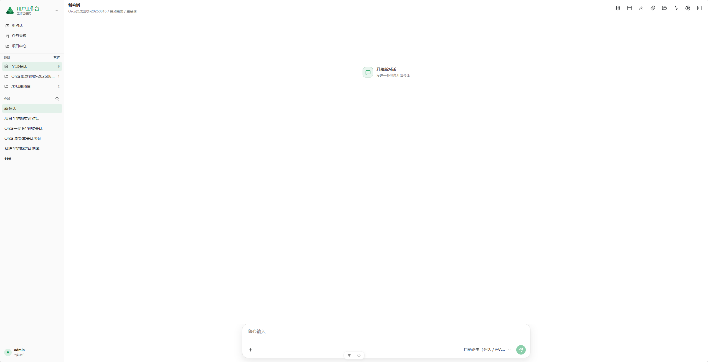

#### Task Status Board

A draggable Kanban board organizes tasks by status and provides search, status filtering, sorting, view switching, and quick task creation.

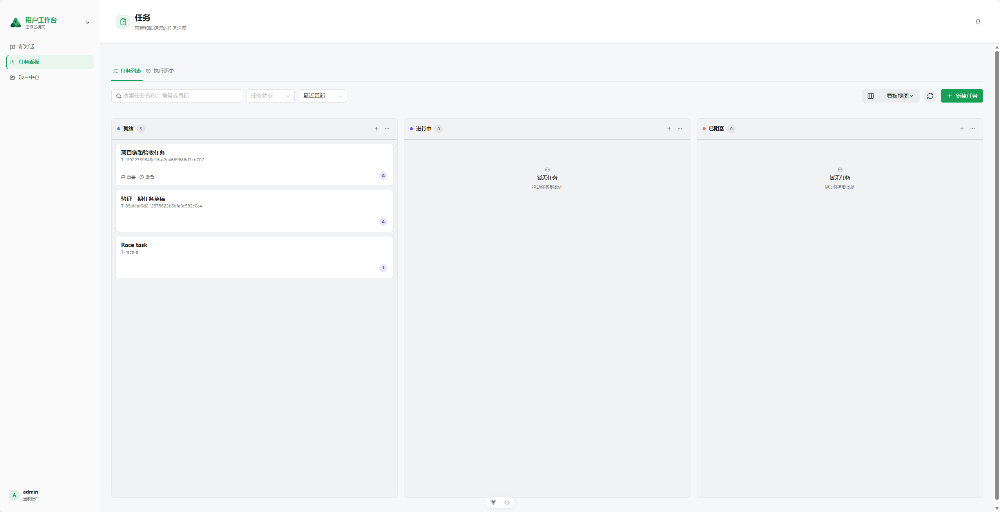

#### Importance-Urgency Matrix

Tasks are arranged by importance and urgency so users can distinguish work that should be handled immediately, planned, delegated quickly, or completed in sequence.

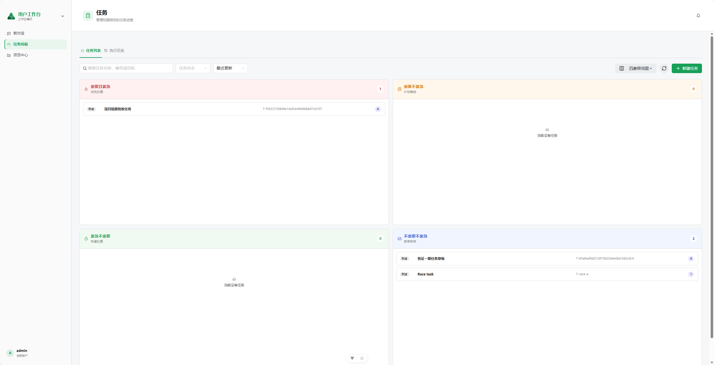

#### Project Center

The project center presents project status, linked tasks, default Agents, and collaboration spaces in one place, giving conversations and tasks a persistent project context.

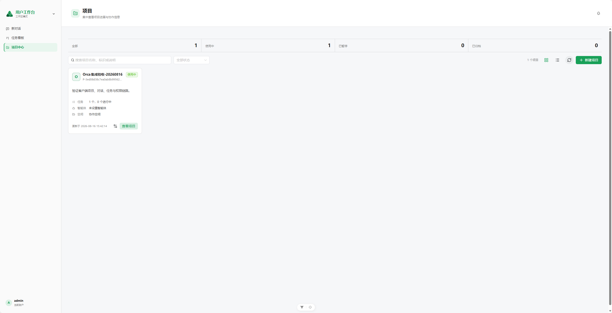

### Configuration Console

#### Administration Workspace

The administration workspace brings together personal action items, token usage, Skills, MCP services, tasks, and data entry points. Recommended scenarios and recent tasks connect configuration work with daily operations.

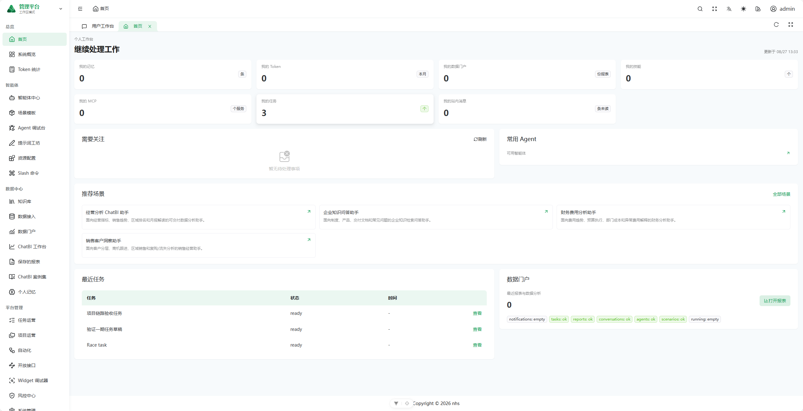

#### Agent Creation Wizard

Agent configuration is divided into five stages: basic information, role and instructions, engine and runtime, capability assembly, and experience and publication. This guided flow reduces the cognitive cost of professional runtime parameters.

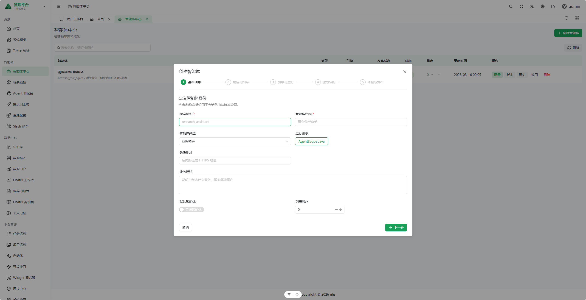

#### Model Configuration

Typed forms configure the provider, service endpoint, credentials, model capabilities, context length, and inference parameters. Model discovery and connection testing are available before publication.

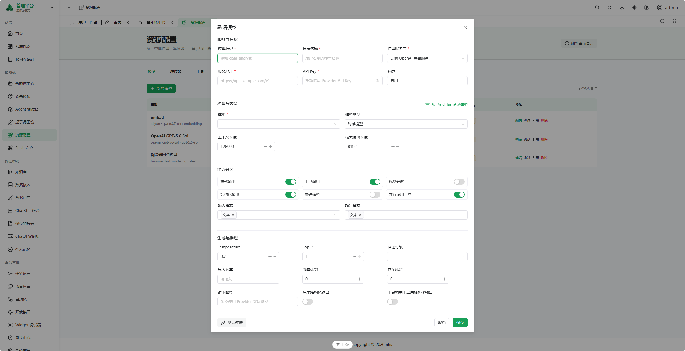

#### MCP Connector

A step-by-step flow configures the service endpoint, transport protocol, namespace, authentication method, and timeout policy, followed by connection validation and tool discovery before activation.

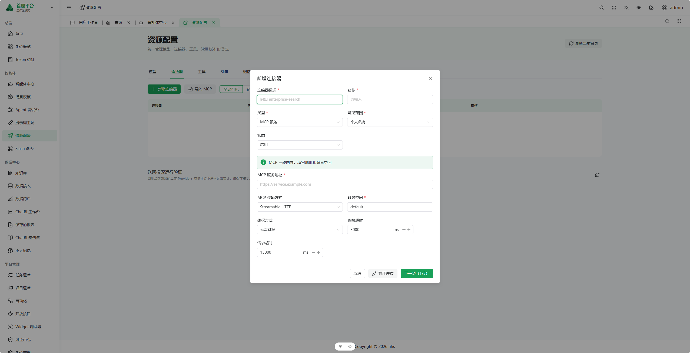

#### Knowledge Base

Knowledge bases, documents, visibility scopes, and retrieval capabilities are managed centrally, with entry points for cross-base retrieval, A/B retrieval testing, and operational metrics.

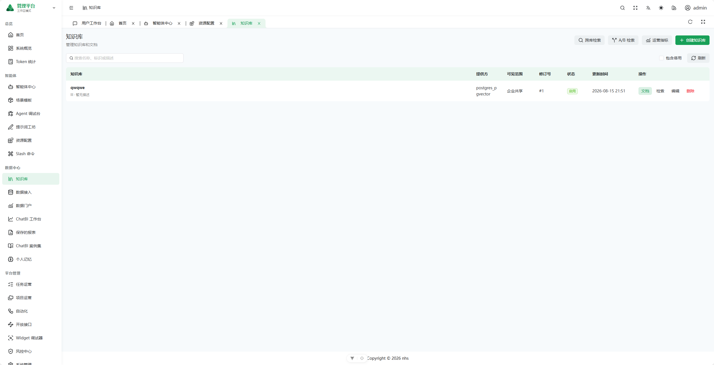

#### Data Integration

Enterprise data connections are managed across three layers: data sources, datasets and metadata, and read-only queries. The implementation supports managed credentials, connection testing, and enable/disable controls.

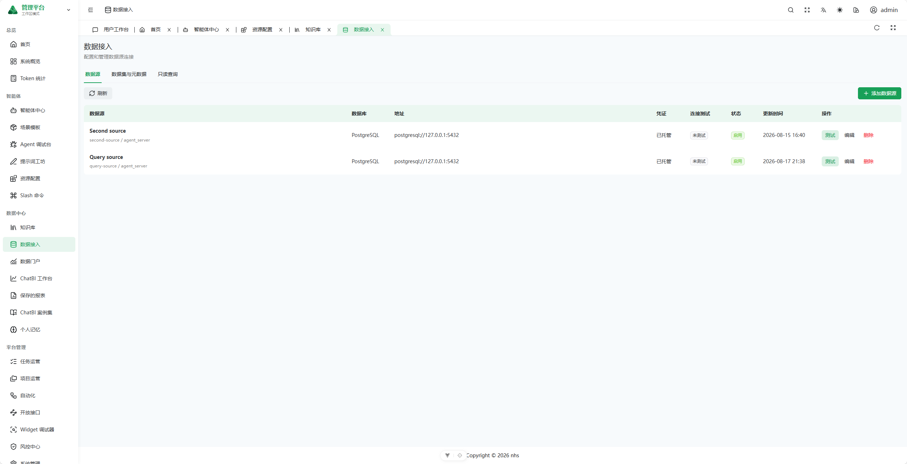

### Governance and Operations Console

#### Risk Control Center

The approval workspace, audit logs, notification inbox, and risk policies share a single governance entry point for handling high-risk execution and human confirmation.

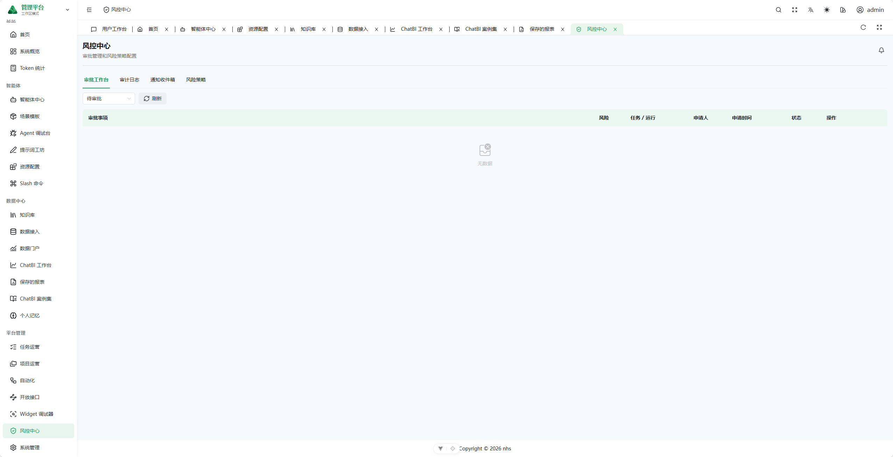

#### Open API and Embed

API applications, service accounts, a Playground, API documentation, and Embed debugging support the secure integration of published Agents into external business systems.

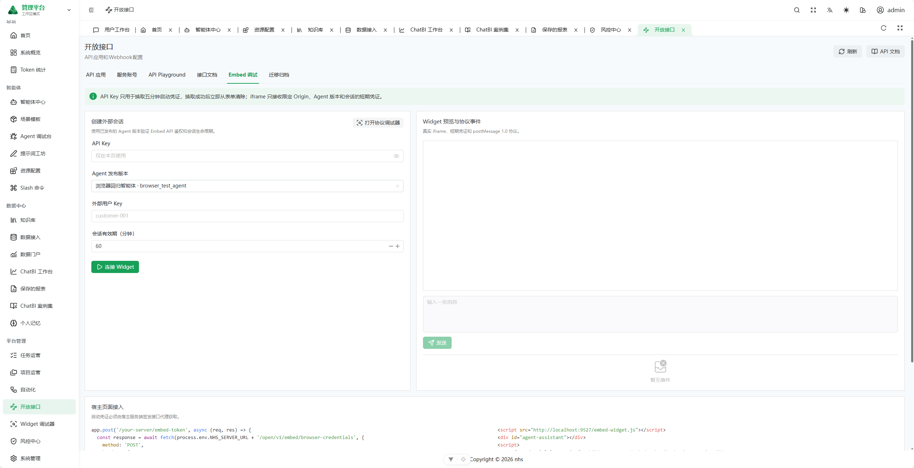

#### Members and Permissions

Member details consolidate permission packages, individual overrides, temporary grants, and reference-user permission copying, balancing authorization efficiency with complete change traceability.

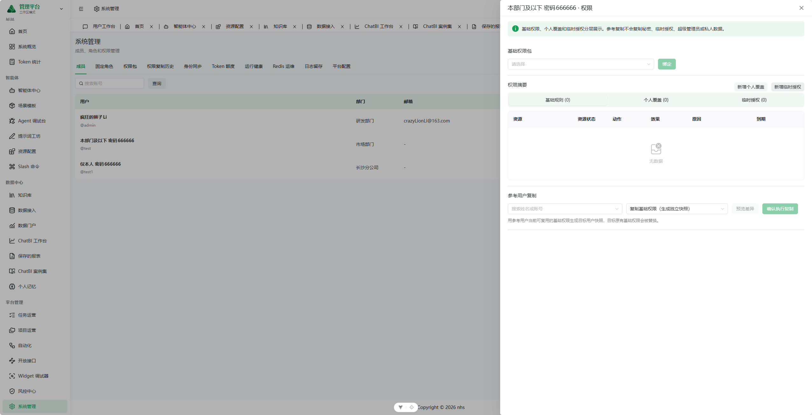

#### Token Analytics

Input tokens, output tokens, and interaction counts are aggregated over selectable time ranges. Agent and user consumption rankings are paired with per-call details.

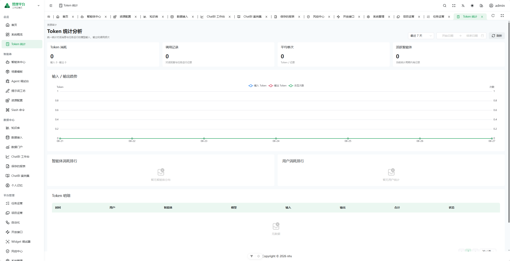

## 4. Core Business Loop

The platform is designed around completing verifiable work, rather than treating a model-generated response as the endpoint.

```text
Authentication / identity resolution
  -> Start a private conversation or explicitly create a task
  -> Bind project and task context
  -> Freeze Agent, resource, and permission snapshots
  -> Execute through the runtime (currently adapted to AgentScope)
  -> Invoke tools / MCP / knowledge bases / data sources / Sandbox / Browser
  -> Request approval, confirmation, or user input at high-risk checkpoints
  -> Produce artifacts such as messages, files, and reports
  -> Accept the result or return it for rework
  -> Persist notifications, audits, traces, and usage records
```

The responsibilities of the core objects are deliberately separated:

- **Conversation**: A private-by-default interaction space for low-friction requests, contextual continuity, and result presentation.
- **Project**: A long-lived collaboration context that organizes members, tasks, default Agents, files, and runtime policies.
- **Task**: The formal unit of shared enterprise work, with an objective, priority, lifecycle state, version, and acceptance result.
- **Execution**: A single concrete run with its own runtime state, event timeline, resource snapshot, cost, and error information. Task state and execution state are not conflated.
- **Artifact**: A deliverable produced by an execution, such as a file, query result, chart, report, or other output.
- **Acceptance**: The business user's decision to accept, reject, or request rework. An Agent claiming that work is complete does not close the task by itself.
- **Approval and audit**: Human control over sensitive tools, data access, and critical operations, backed by traceable evidence.

## 5. Business Modules

### 5.1 User Client

The user client uses a dedicated full-screen layout and opens at `/app` by default. It intentionally hides most engineering-level platform configuration and retains only the three high-frequency entry points required by business users.

| Module | Implemented capabilities |
| --- | --- |
| Conversational workspace | Project and conversation grouping, conversation search, history, automatic routing, `@Agent`, explicit Agent selection, streaming messages, execution events, user confirmation and follow-up questions, referenced content, charts, code, SQL plans, Mermaid diagrams, workspace files, and artifact previews |
| Task center | Name and condition filters, list view, status board, importance-urgency matrix, task creation, single-Agent or fixed multi-Agent orchestration, resource authorization, execution details, version snapshots, steps, artifacts, and acceptance records |
| Project center | Card and list views, project search, creation and editing, default Agent, project members, related tasks, workspace settings, and isolation policies |

The client and administration console share the same authenticated session and backend authorization system. Only accounts with authorized administration routes should see and use the workspace switcher.

### 5.2 Configuration Console

The configuration console uses the standard SoybeanAdmin layout and relies on backend-generated dynamic routes to control which menus each account can access. It is designed for professional operators rather than ordinary business users.

| Module | Routes | Implemented capabilities |
| --- | --- | --- |
| Administration workspace | `/home` | Action items, frequently used Agents, recommended scenarios, recent tasks, and data entry points |
| Collaborative workspace | `/workspace` | Administrative conversational workspace, workspace files, and Browser control |
| Task and project operations | `/task-center`, `/project-center` | Enterprise task execution and acceptance; project members and roles; file, network, and notification policies |
| Agent center | `/agent-center` | Guided creation, system prompts, model and runtime policies, Skill/tool/knowledge-base assembly, welcome experience, version publication, execution history, and traces |
| Agent debugger | `/agent-debug` | Debug runs, real-time events, replay, approval state, and Browser control |
| Resource center | `/resource-center` | Models, MCP/Search/API connectors, tools, Skills, and memory; including connection testing, tool discovery, ZIP Skill import, versioning, and publication review |
| Knowledge base | `/knowledge` | Catalogs, permissions, documents, parsing, chunking, embeddings, retrieval policies, metrics, and retrieval experiments |
| Data integration | `/data-source` | Data sources, datasets, metadata catalogs, fields and metrics, profiles, table relationships, row policies, import/export, and read-only queries |
| Automation | `/automation` | Manual, Cron, and Webhook triggers; fixed task-version and service-account bindings; retry policies |
| Open API | `/open-api` | API applications, service accounts, machine-identity authorization, credentials, API documentation, Playground, Embed, and migration archives |
| Prompt and scenario tooling | `/prompt-studio`, `/scenario-templates`, `/slash-commands` | Prompt versioning and variable testing, scenario-template delivery, and personal shortcut commands |

The configuration experience follows a forms-, wizards-, and guided-selection-first principle. Raw JSON should exist only as an internal transport format or advanced diagnostic representation; ordinary operators should never be expected to author undocumented JSON structures manually.

### 5.3 Governance and Operations

| Module | Routes | Implemented capabilities |
| --- | --- | --- |
| Risk control center | `/risk-control` | Approval workspace, audit logs, notification inbox, and risk policies |
| Identity and system administration | `/system` | Members, fixed roles, permission packages, permission-copy history, identity synchronization, token quotas, runtime health, Redis operations, log retention, and platform configuration |
| Operations dashboards | `/dashboard`, `/token-stats` | Execution success rates, Token/API usage trends, Agent health, user and Agent rankings, and call-level details |
| Data portal and ChatBI | `/data-portal`, `/chatbi` | Data catalog, natural-language analysis, read-only SQL, charts and pivot tables, history, briefings, monitoring, and drill-down analysis |
| Reports and examples | `/saved-reports`, `/examples` | Report definitions, parameterized execution, subscriptions, run history, and ChatBI example governance |
| Personal center and memory | `/personal-center`, `/memory` | Profile, effective permissions, quotas, notifications, personal resources, conversation summaries, long-term preferences, and memory operations |

The frontend also retains the `/embed/chat` embedded conversation surface and `/client/debug` Widget protocol debugger for integrating platform capabilities into third-party business systems.

## 6. System Architecture

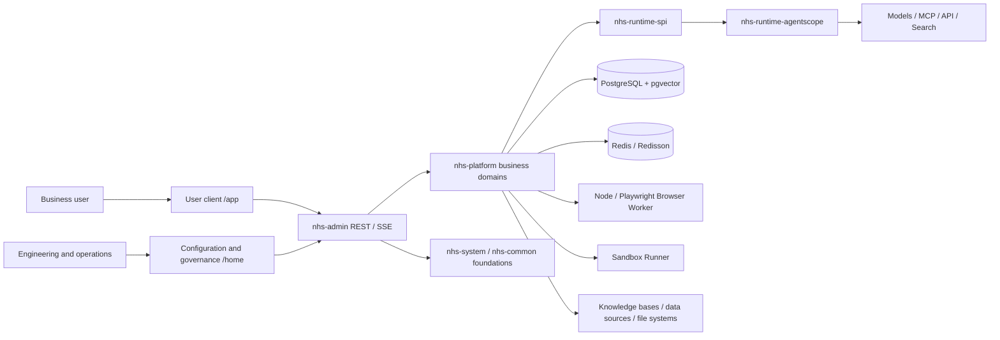

### 6.1 Frontend

- Vue 3, TypeScript, Vite 8, Naive UI, and UnoCSS.
- SoybeanAdmin provides the administration foundation, including authentication, dynamic routing, layout, and engineering toolchain.
- `/app` uses a dedicated client layout; `/home` and other administration pages use the standard console layout.
- Candidate routes are generated in the frontend, but the backend authorization result determines the final menu and accessible scope. Hiding menu items is never treated as an authorization boundary.
- Queries and configuration use REST. Long-running executions and incremental conversation results are presented through SSE and event streams.

### 6.2 Backend Modules

| Maven module | Responsibility |
| --- | --- |
| `nhs-admin` | Spring Boot application entry point, environment configuration, and module assembly |
| `nhs-platform` | Platform domains for Agents, conversations, projects, tasks, executions, resources, knowledge, data, approvals, auditing, open APIs, and related capabilities |
| `nhs-runtime-spi` | Runtime contracts independent of any specific Agent engine |
| `nhs-runtime-agentscope` | AgentScope Java runtime adapter |
| `nhs-sandbox-runner` | Standalone runner for untrusted or strongly isolated execution |
| `nhs-migration-cli` | Utilities for migration inventory, conversion, and validation |
| `nhs-system`, `nhs-common-*` | Foundation-framework capabilities for users, permissions, Web, MyBatis, Redis, logging, encryption, and related concerns |
| `nhs-api`, `nhs-extend` | Public API contracts and optional services for monitoring, scheduling, and other extensions |

Within `nhs-platform`, code is organized by business domain. Primary packages include `agent`, `conversation`, `project`, `task`, `execution`, `workflow`, `model`, `connector`, `skill`, `knowledge`, `memory`, `data`, `approval`, `artifact`, `automation`, `notification`, `identity`, `iam`, `openapi`, `embed`, `audit`, `risk`, `browser`, `sandbox`, `report`, `scenario`, `operations`, and `portal`.

### 6.3 Runtime and Isolated Execution

- The project extracts `nhs-runtime-spi` as a dependency boundary and integrates AgentScope through a separate adapter module, leaving room for additional engines. AgentScope-specific semantics and recovery protocols still exist, however, and runtime substitutability has not yet been validated.
- The AgentScope adapter is conditionally enabled. Maintainers must verify the active runtime profile and `NHS_RUNTIME_AGENTSCOPE_ENABLED`; the presence of a Maven dependency alone does not prove that the runtime is enabled.
- Publishing an Agent creates a version. When a task runs, the platform freezes snapshots of the Agent, model, tools, Skills, knowledge, and permissions so later configuration changes cannot invalidate historical explainability.
- The Browser Worker is an independent Node/Playwright process. The Java application calls its HTTP API and does not execute untrusted browser code inside the JVM. Browser contexts exist only in Worker memory; after a Worker restart, stale sessions must be invalidated and reopened.
- The Sandbox Runner isolates code execution and Skill dependencies from the main application and its host environment.
- High-risk tools, browser takeover, sensitive data operations, and Agent-initiated questions transition through durable wait/resume states for human intervention.

### 6.4 Data and Infrastructure

- PostgreSQL 16+ is the source of truth for business persistence, with `pgvector` for vector data. Redis/Redisson is used only for caching, locks, and short-term coordination, never as the final source of business truth.
- Platform SQL is located under `backend/script/sql/postgres/agent/`. The current migration head is `V99`, with 98 migration scripts in total; `V58` is reserved. An older note in that directory still ends at `V94`, so future work should treat the migration files and this section as authoritative and update the stale documentation accordingly.
- Published migration scripts should remain immutable. Subsequent changes must be introduced as new versions.
- The data model avoids complex foreign keys and cross-domain cascading dependencies where possible, favoring unique constraints, state machines, transactions, version fields, and application-level validation. A small number of necessary foreign keys exist in the current migrations, so the database must not be assumed to have zero foreign keys.
- The platform is designed for private deployment within a single enterprise and does not duplicate a product-level tenant model across core platform tables.
- Secrets, database passwords, model API keys, and connector credentials must be encrypted at rest or stored as secure references. They must never appear in seed SQL, frontend responses, logs, or screenshots.

## 7. Design Principles

1. **Close the business loop first**: Conversation is only the entry point. Tasks, executions, artifacts, and acceptance collectively define completed work.
2. **Separate user experiences by audience**: Business users interact with conversations, tasks, and projects; complex resource configuration belongs in the administration console; operational and security information belongs in the governance console.
3. **Make configuration human-readable**: Models, APIs, MCP services, Search, Skills, knowledge, and data sources use typed forms or guided flows instead of requiring users to enter unexplained JSON.
4. **Separate configuration from execution**: Mutable configuration produces immutable published versions. Executions reference frozen snapshots for auditing, replay, and diagnosis.
5. **Enforce least privilege and deny by default**: Explicit denial takes precedence. Private conversations and enterprise-shared tasks belong to different visibility domains, and the backend must always repeat resource-level authorization checks.
6. **Separate identity types**: Human users, service accounts, and API applications are distinct principals. Their credentials, scopes, and audit records are never conflated.
7. **Evolve through runtime decoupling**: An SPI establishes the current dependency boundary. Future work must further contain AgentScope-specific semantics and validate a second runtime engine.
8. **Keep persisted facts traceable**: Critical states, approvals, events, snapshots, consumption, and results are persisted in PostgreSQL. Loss of cache data must not alter the final business outcome.
9. **Isolate untrusted execution**: Browsers, code, third-party Skills, and external connectors run in risk-appropriate isolation zones with leases, timeouts, confirmations, and audit controls.
10. **Design private delivery for operations**: The platform must support offline installation, configuration encryption, health checks, backup and recovery, upgrades, and rollbacks, not merely successful startup in a development environment.

## 8. Authorization and Sharing Model

Platform authorization is not a single role-and-menu model. Access is determined by multiple layers:

```text
Authenticated principal
  -> Fixed role / permission package / direct grant
  -> Route and operation permissions
  -> Project membership and task access rules
  -> Agent and resource authorization snapshots
  -> Fine-grained policies for data catalogs, knowledge catalogs, connectors, and tools
  -> Risk policies, approvals, and audits
```

Primary constraints:

- Private conversations are visible only to their owners by default; membership in the same enterprise does not make them automatically shared.
- Projects and tasks can be shared through membership, roles, and access rules. A task execution may use only the resources authorized and frozen for that run.
- `deny` rules take precedence over `allow`; access is denied when no grant exists.
- Menu permissions determine entry-point visibility only. APIs and data access remain subject to backend authorization.
- Permission copying uses a selected reference user rather than requiring an administrator to enter a raw user ID. The copy operation itself must be audited.
- Service accounts are intended for automation and machine calls. They must not impersonate human users or receive unexplained global permissions.

## 9. Open-Source Licenses

The backend is based on [RuoYi-Vue-Plus](https://github.com/dromara/RuoYi-Vue-Plus), and the frontend is based on [SoybeanAdmin](https://github.com/soybeanjs/soybean-admin). Both projects are licensed under the MIT License; their license files are retained at `backend/LICENSE` and `frontend/LICENSE`, respectively. `nhs` is retained only as the internal codename for source packages, services, and database objects.

> Future direction: because the Java ecosystem for AI Agents remains relatively constrained, future development is planned as a newly designed, open-source Python project. This repository will remain available as a reference for the existing business implementation and architecture.
