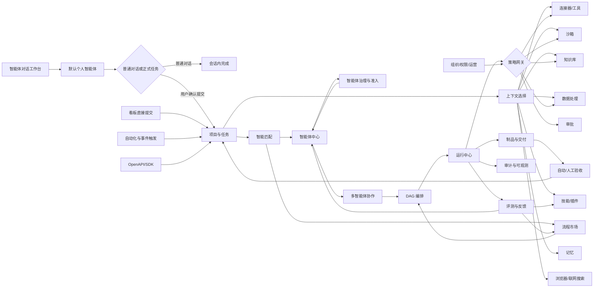

# 企业级智能体工作平台功能模块规划

> 文档性质：产品完整形态与功能定义稿
> 版本：1.1
> 规划日期：2026-08-12

## 1. 产品总体定义

**普通交流在智能体会话中完成；需要持续执行和正式交付时，经用户确认转为任务。平台组织智能体、数据、技能、工具、沙箱和审批完成执行，人负责关键决策和验收，系统沉淀过程、结果与经验。**

产品完整形态应包含以下 16 个产品域：

| 产品域 | 主要解决的问题 |
|---|---|
| 智能体对话工作台 | 用户进入系统后如何直接与自己的智能体工作 |
| 会话与任务转换 | 普通对话何时保持会话，何时由用户确认转成正式任务 |
| 项目与任务 | 工作目标如何定义、拆分、跟踪和验收 |
| 多智能体协作 | 多个智能体如何分工、沟通、委派和协同交付 |
| DAG 流程编排 | 复杂任务如何按依赖、条件和并行关系自动运行 |
| 智能体中心 | 企业、个人、项目和任务所需智能体如何定义与复用 |
| 智能体治理与准入 | 智能体是否安全、合规、有效，能否被创建和使用 |
| 运行与制品 | 一次执行如何启动、暂停、恢复、接管并产生交付物 |
| 技能与插件 | 智能体如何获得可复用的专业经验和扩展能力 |
| 连接器与工具 | 智能体如何安全访问 API、MCP、数据库和业务系统 |
| 浏览器与联网能力 | 智能体如何安全浏览网页、联网搜索、读取页面和执行浏览器操作 |
| 沙箱与工作环境 | 智能体和人员在哪里安全地运行代码、命令和文件操作 |
| 知识、数据与记忆 | 企业数据、项目知识、上下文和经验如何被使用与沉淀 |
| 模型与评测 | 使用什么模型，如何衡量质量、成本和稳定性 |
| 应用与渠道发布 | 如何把智能体和流程发布给员工或嵌入业务系统 |
| 安全、权限与运营 | 谁能看、谁能做、谁批准、发生了什么以及花了多少钱 |

### 1.1 用户进入产品后的主路径

```text
智能体对话工作台
  -> 默认进入用户自己的个人智能体
  -> 可切换到用户有权限使用的共享、项目或其他个人智能体
  -> 普通问题直接在会话中完成，不创建正式任务
  -> 识别到持续执行、多人协作、后台运行或正式交付需求
  -> 智能体生成任务草稿和任务级别建议
  -> 用户确认任务内容、执行方式、资源和授权范围
  -> 创建任务并进入运行/看板管理
  -> 查看智能体运行、审批、日志和中间结果
  -> 验收制品 / 返工 / 人工接管
  -> 任务完成后沉淀记忆、知识、评测反馈和经验技能
```

### 1.2 产品中的核心对象

```text
组织 -> 用户 / 用户组 / 权限角色
用户 -> 默认个人智能体 -> 对话会话
项目 -> 任务 -> 子任务 -> 任务运行 -> 执行步骤 -> 制品
智能体定义 -> 智能体版本 -> 任务运行实例
智能体版本 -> 治理申请 -> 测试报告 -> 安全评估 -> 准入结果
技能 / 插件 / 工具 / 连接器 / 模型 -> 智能体能力
知识库 / 数据资产 / 记忆 -> 任务上下文
策略 / 审批 / 临时凭证 -> 任务运行授权
```

---

## 2. 智能体对话工作台模块

### 2.1 模块定义

智能体对话工作台是用户进入平台后的默认首页。用户首先进入自己的个人智能体，通过对话完成咨询、分析、生成和轻量操作；看板、项目和运行中心是用户需要管理正式任务时进入的工作空间，而不是默认首页。

### 2.2 功能组成

#### A. 默认个人智能体

- 每个用户默认拥有一个个人智能体入口。
- 默认个人智能体由企业已治理通过的基础模板实例化；用户仅修改展示和偏好字段时无需完整复审，新增工具、数据、系统规则或执行能力时必须重新治理。
- 默认个人智能体继承用户已确认的个人偏好、个人记忆和允许使用的基础能力。
- 默认个人智能体不能自动继承用户全部业务系统权限，工具调用仍按用户、项目和任务策略判断。
- 用户可以设置默认模型、回答风格、常用技能、常用知识库和常用工作方式。
- 用户可以重置、暂停、替换默认个人智能体，但历史会话和任务保留原智能体版本。

#### B. 智能体切换

- 切换到用户有权限使用的共享智能体、其他个人智能体、项目智能体或已发布的智能体应用。
- 根据当前项目、会话主题、最近使用和权限范围推荐可切换智能体。
- 切换前展示智能体职责、治理状态、可用工具、数据范围和限制。
- 不允许切换到草稿、治理不通过、治理过期或已撤销的智能体版本。
- 支持“本次会话切换”和“设为默认智能体”两种方式。

#### C. 我的工作

- 我的待办任务、我创建的任务、我参与的任务、我关注的任务。
- 待审批动作、待补充信息、待验收制品、被阻塞任务。
- 最近访问项目、智能体、知识库、沙箱和连接器。
- 任务按紧急性、重要性、风险和状态聚合。
- 个人快捷入口：新建任务、继续运行、打开工作环境、查看记忆。

#### D. 智能体工作流

- 查看智能体正在执行的任务。
- 查看智能体等待什么：用户输入、权限审批、连接器恢复、测试结果。
- 一键暂停、恢复、取消、重试和人工接管。
- 将运行中的子任务转交给其他智能体或人员。
- 查看今日执行数量、成功率、失败原因和成本。

#### E. 通知中心

- 任务指派、状态变更、审批请求、运行失败、制品生成、验收结果通知。
- 站内信、邮件、企业微信、飞书、钉钉、Webhook 等通知渠道。
- 通知规则、免打扰时段、通知升级和重复通知抑制。
- 通知中直接执行批准、拒绝、补充信息和验收操作。

#### F. 全局搜索与命令入口

- 搜索任务、项目、智能体、技能、插件、连接器、知识和制品。
- 按用户权限过滤搜索结果。
- 自然语言命令：创建任务、查找运行、打开项目、请求审批。
- 快速启动器：输入 `@` 查找人员、智能体、技能和资源。

### 2.3 对话首页布局

- 顶部：当前智能体、智能体切换、治理状态和当前工作范围。
- 中部：主对话区，支持文本、文件、图片、语音、代码和结构化输入。
- 对话输入区附近：任务提交入口、能力/工具选择、上下文选择和会话设置。
- 侧边区域：最近会话、运行中的任务、待审批事项和最近制品。
- 看板入口保留在主导航和任务卡片中，用户可以随时进入，但不作为默认首屏。

### 2.4 关键规则

- 工作台只展示当前用户有权访问的信息。
- 高风险审批不能仅通过通知预览批准，必须能查看完整动作详情。
- 所有工作台操作都能跳回任务或运行的上下文，而不是孤立通知。

---

## 3. 会话与任务转换模块

### 3.1 模块定义

会话与任务转换模块用于区分“普通对话”和“正式工作”。普通对话直接在当前智能体会话中完成，不自动进入看板；当用户或智能体判断需要持续执行、多人协作、后台运行、正式交付或审批时，先生成任务提交预览，由用户确认后再创建任务。

### 3.2 会话功能

- 新建临时对话、项目对话和智能体专属对话。
- 默认使用当前用户的个人智能体，支持切换到其他有权限的智能体。
- 文本、语音、图片、文件、代码和结构化数据输入。
- `@智能体`、`@技能`、`@知识库`、`@连接器` 和 `@文件` 引用。
- 流式响应、引用来源、工具调用状态和中间制品。
- 对话分支、重新生成、消息编辑、引用回复和关键消息固定。
- 会话搜索、标签、收藏、归档、分享和权限控制。
- 会话上下文长度、Token、成本和数据范围提示。

### 3.3 普通对话与任务边界

#### 普通对话，不创建任务

- 问答、解释、翻译、摘要、头脑风暴和低风险内容生成。
- 查询已授权知识、分析已上传文件和生成一次性结果。
- 用户明确选择“仅在对话中完成”时，即使智能体识别到潜在任务，也不得自动提交。
- 普通对话可以生成临时制品，但不进入项目任务看板，除非用户主动保存或转任务。

#### 需要进入任务

- 需要跨多轮或长时间持续运行。
- 需要后台执行、定时执行或事件触发。
- 需要多个智能体、人员或部门协作。
- 需要使用沙箱、修改代码、写入数据库或调用高风险工具。
- 需要正式交付、验收、审批、外部发送或写回业务系统。
- 需要进入项目看板、统计周期、分配负责人或形成可追踪记录。

### 3.4 对话中的任务提交确认

- 智能体识别到任务意图时，只能展示“建议创建任务”，不能静默提交。
- 任务预览卡展示：任务标题、目标、任务级别、执行方式、执行者、项目、资源、权限、风险、预计成本和开始时间。
- 用户可以确认提交、修改内容、选择其他智能体、改为普通对话或取消。
- 用户确认后才创建任务、生成任务 ID 和进入看板/运行中心。
- 任务提交后，当前会话与任务双向关联，用户可以继续对话，也可以打开任务详情。
- 用户可以在对话中直接查看任务状态、审批请求、运行结果和制品。

### 3.5 任务提交触发方式

- 用户主动点击“创建任务”。
- 用户使用明确命令，例如“提交为任务”“开始执行”“创建长期任务”。
- 智能体识别到需要任务化，但必须等待用户确认。
- 外部事件和 API 可以直接创建任务，但必须使用预先配置的自动化策略，不适用于普通会话。

### 3.6 会话转任务

- 从整段会话或选中消息创建任务。
- 自动提取任务目标、背景、约束、交付物和验收条件。
- 将会话中使用的智能体、文件、知识和工具转为任务上下文候选。
- 将长时间执行、需要审批或有副作用的操作升级为正式任务运行。
- 任务创建后保留会话来源和双向跳转。

### 3.7 会话边界

- 查询和探索可以停留在会话中。
- 需要长期运行、多人协作、后台执行、审批、沙箱写入或正式交付时必须转为任务。
- 会话中的工具调用同样经过权限和策略网关，不能绕过任务治理。
- 临时会话默认不进入长期记忆，只有明确确认或符合记忆策略的内容才能沉淀。

---

## 4. 项目与任务模块

### 4.1 模块定义

项目是工作的协作边界，任务是需要完成的业务目标。项目可以配置自己的智能体、知识、连接器、沙箱、记忆、权限和流程模板。

### 4.2 项目功能

#### A. 项目空间

- 创建项目、项目模板、项目归档和项目移交。
- 项目成员、项目角色、外部协作者和服务账号。
- 项目首页：目标、任务统计、运行情况、风险、成本和最近制品。
- 项目设置：默认智能体、默认模型、知识源、连接器、沙箱模板、通知和验收规则。
- 项目级 `AGENTS.md`、规则文档、术语表和工作偏好。
- 项目资产目录：代码仓库、文档、数据库、API、数据集和环境。

#### B. 任务创建

- 任务标题、任务描述、背景、目标和完成定义。
- 任务类型：研发、分析、运营、审批、客服、数据处理、自动化等。
- 四象限：重要且紧急、重要不紧急、紧急不重要、不重要不紧急。
- 独立的风险等级、业务优先级、队列优先级和阻塞状态。
- 仅设置任务开始时间：立即、指定时间、事件触发；不设置业务结束时间。
- 运行保护参数：单次最大运行时长、无活动超时、预算上限、重试次数和凭证有效期。
- 任务负责人、协作者、验收人、关注人和外部关联人。
- 任务标签、自定义字段、来源系统、外部 ID 和幂等键。

#### C. 任务描述与智能体指派

- 富文本、Markdown、附件、表格、代码块和结构化数据输入。
- 使用 `@人员`、`@共享智能体`、`@个人智能体`、`@项目智能体` 指派。
- 使用 `@智能体组` 指定一组并行或串行执行者。
- 使用 `@技能`、`@知识库`、`@连接器` 引用任务资源。
- 解析自然语言中的目标、约束、依赖、输出格式和验收条件。
- 将自然语言委派转换为结构化子任务，并在发布前让用户确认。

#### D. 任务提交类型与级别

任务不能只使用一个“任务类型”字段。建议由五个正交维度共同定义，避免业务类别、编排方式、运行周期和风险级别相互混淆：

- **业务类别**：研发、数据、运营、客服、人事、财务、审批等，描述“做什么业务”。
- **提交入口**：对话确认、看板直接提交、模板、批量、事件或 API，描述“从哪里创建”。
- **编排模式**：单智能体、自定义 DAG、多智能体协作、人工流程或混合编排，描述“由谁以及按什么流程执行”。
- **生命周期级别**：L0-L3，描述“是否需要任务化以及运行多久”。
- **风险等级**：R0-R4，描述“动作影响和治理强度”。

任务提交时不应只让用户填写一张通用表单，而应由系统根据对话内容推荐生命周期、编排模式和风险等级，再由用户确认。

| 生命周期 | 是否创建任务 | 适用场景 | 默认能力 |
|---|---|---|---|
| L0 普通对话 | 否 | 问答、解释、生成、一次性分析 | 当前会话内完成 |
| L1 快速任务 | 是 | 短时、低复杂度、需要记录或后台执行 | 任务 ID、运行状态、简单制品 |
| L2 标准任务 | 是 | 可追踪、需正式交付或验收 | 完整运行、制品、验收、重试 |
| L3 长期任务 | 是 | 跨天、跨阶段、持续上下文和人工介入 | 检查点、阶段制品、恢复和阶段验收 |

编排模式可以与生命周期自由组合：

- **单智能体**：由一个智能体完成，适合快速或标准任务。
- **自定义 DAG**：使用已发布流程或临时流程图，可用于快速、标准或长期任务。
- **多智能体协作**：主管、并行专家、流水线或生成者-评审者模式。
- **人工流程**：以人工节点为主，智能体负责准备材料和辅助判断。
- **混合编排**：DAG 中同时包含智能体、人员、工具、数据和审批节点。
- **自动化运行**：不是独立任务类型，而是任务的触发方式，可作用于任何已允许自动运行的编排模式。

风险等级独立采用 R0-R4。一个长期任务不一定高风险，一个快速任务也可能因为生产写入而成为 R3。权限仍由用户、项目、智能体、工具和任务授权共同判断。

#### E. 任务提交方式

- **直接提交**：用户在任务页面填写并提交。
- **对话确认提交**：智能体从对话生成任务预览，用户确认后提交。
- **模板提交**：用户选择项目任务模板、DAG 模板或专家流程后补充参数。
- **批量提交**：上传表格、数据集或多条业务记录，生成多个任务或一个批处理任务。
- **事件提交**：由自动化规则、Webhook、定时器或外部系统创建。
- **复制提交**：从历史任务、成功运行或已有制品复制任务配置。

不同提交方式最终都生成同一套任务对象和任务运行对象，不能形成多套互不兼容的执行逻辑。

#### F. 看板与视图

- Kanban 看板：待规划、准备中、执行中、等待输入、待审批、待验收、已完成、已取消。
- 列表视图：筛选、排序、批量编辑、批量指派和批量启动。
- 四象限视图：以重要性和紧急性展示任务。
- 时间线视图：展示开始时间、运行区间、等待区间和依赖关系。
- DAG 视图：展示子任务依赖、并行分支、条件分支和失败回退。
- 运行视图：展示任务下所有运行实例、版本和成本。

看板既是任务管理入口，也是独立的任务提交入口。用户可以不经过对话，直接在看板中创建快速任务、标准任务、自定义流程任务、多智能体协作任务或长期项目任务；但所有任务最终使用同一套任务类型、运行、权限、审批和验收规则。

#### G. 任务生命周期

```text
草稿 -> 准备中 -> 已计划 -> 执行中 -> 等待输入/审批/资源
     -> 验收中 -> 已完成
                      |-> 返工
                      |-> 失败
                      |-> 取消
```

#### H. 任务验收

- 定义验收人、验收组或自动验收规则。
- 验收制品、测试报告、数据结果、API 响应、代码变更或文档。
- 自动验收：Schema、规则、单元测试、集成测试、差异检查、指标阈值。
- 人工验收：通过、驳回、要求修改、部分通过。
- 验收意见自动回写任务，作为下一次运行的输入。

### 4.3 关键规则

- “无结束时间”只针对业务任务；运行仍必须有超时、预算和凭证过期保护。
- 任务完成必须有可验证的交付物或明确的人工结论。
- 任务描述中的 `@` 引用必须映射为真实对象 ID，不能只保存文本。
- 任务启动后，智能体、技能、插件、连接器、模型和权限均生成版本快照。

---

## 5. 多智能体协作模块

### 5.1 模块定义

多智能体协作模块负责定义“多个智能体如何共同完成一个目标”。它解决的是角色分工、上下文交换、委派关系、协作协议和合并验收问题；不负责具体的任务依赖调度，调度由 DAG 编排模块负责。

### 5.2 协作角色

- **主管智能体**：理解目标、拆解任务、分配工作、汇总结果和触发验收。
- **执行智能体**：完成具体专业工作，如前端、后端、测试、数据分析。
- **评审智能体**：检查质量、安全、规范、事实和验收条件。
- **协调智能体**：处理冲突、依赖、资源不足和跨团队沟通。
- **观察智能体**：只读监控任务状态、风险、成本和异常。
- **人工负责人**：最终决策、审批、验收和接管。

### 5.3 协作模式

#### A. 主管-执行者模式

- 主管智能体生成子任务。
- 执行者完成并提交结构化结果。
- 主管检查结果并决定继续、返工或升级人工。
- 限制最大委派深度、子任务数量和总预算。

#### B. 流水线模式

```text
需求分析 -> 方案设计 -> 实现 -> 测试 -> 安全审查 -> 交付
```

上一步产出结构化制品，下一步只能读取已授权的输入。

#### C. 并行专家模式

- 前端、后端、数据、测试等智能体并行执行。
- 汇总智能体合并结果，解决冲突并生成统一制品。
- 支持“全部完成后汇总”“达到 N 个完成后汇总”“任一失败即停止”等策略。

#### D. 生成者-评审者模式

- 生成智能体先产出结果。
- 评审智能体根据规则和测试集进行检查。
- 不通过时自动回传具体问题，限制最大修订轮次。

#### E. 竞争与仲裁模式

- 多个智能体独立生成方案或判断。
- 评审/仲裁智能体根据评分标准选出结果。
- 仅用于高价值、可比较的方案，不作为普通任务默认模式。

#### F. 人机混合模式

- 智能体负责准备材料，人负责关键判断。
- 人可以在任意可配置节点暂停并接管。
- 人完成后可将控制权交还给原智能体或指定其他智能体。

### 5.4 协作通信

- 结构化消息：指令、状态、问题、请求、确认、拒绝。
- 任务委派：目标、输入、输出、依赖、预算、权限和验收条件。
- 上下文引用：通过 context ID 引用任务上下文，不直接复制全部历史。
- 制品传递：文件、代码变更、数据集、报告、结构化 JSON、API 结果。
- 事件通知：开始、进度、等待、阻塞、失败、完成和需人工处理。
- 冲突处理：版本差异、制品合并、互斥写入、优先级和人工仲裁。
- 协作可视化：智能体关系图、消息时间线、委派树和当前控制权。

### 5.5 协作规则

- 每个智能体都声明可被委派的能力、输入输出格式和权限边界。
- 智能体不能因为被另一个智能体调用而自动继承调用者的全部权限。
- 子任务必须有来源任务、负责人、交付物和验收方式。
- 协作过程中不得形成无限循环、隐式转派或未授权的横向访问。

---

## 6. 多智能体 DAG 流程编排模块

### 6.1 模块定义

DAG 编排模块用于把复杂任务编排成可视化、有向无环执行图。它负责节点、依赖、并行、条件、循环边界、重试、超时、补偿和版本发布，是多智能体从“聊天协同”进入“可执行流程”的核心模块。

### 6.2 流程设计器

- 拖拽式节点编排。
- 节点连线、依赖关系和执行顺序。
- 节点分组、子流程和可复用流程组件。
- 画布缩放、自动布局、搜索节点和路径高亮。
- 草稿、校验、发布、版本、复制、回滚和归档。
- 流程模板：研发交付、数据处理、内容生产、工单处理、审批流。

### 6.3 节点类型

#### A. 智能体节点

- 指定固定智能体。
- 按能力、项目和风险自动匹配智能体。
- 指定模型、技能、工具、知识和沙箱。
- 配置输入模板、输出 Schema、预算和最大轮次。

#### B. 人工节点

- 人工审批、人工输入、人工验收、人工分派和人工仲裁。
- 指定个人、角色、用户组或动态负责人。
- 配置超时升级、代理人、会签、或签和加签。

#### C. 工具节点

- 调用 API、MCP 工具、数据库查询、Webhook、脚本或系统命令。
- 配置参数映射、密钥引用、超时、重试、限流和幂等。
- 标记读、写、删除、外发和生产操作风险。

#### D. 数据节点

- 查询数据源、转换数据、清洗数据、聚合数据和生成数据集。
- 结构化查询、SQL 模板、字段映射和结果校验。
- 数据脱敏、行列权限、结果条数和导出限制。

#### E. 控制节点

- 条件分支、并行分支、汇聚、延迟、等待事件、循环和子流程调用。
- “全部完成”“任一完成”“N 个完成”“任一失败停止”等汇聚策略。
- 按条件选择模型、智能体、连接器、审批路径和回退路径。

#### F. 交付节点

- 创建制品、写回代码仓库、创建工单、发送通知、调用外部 OpenAPI。
- 绑定验收规则、交付渠道、文件格式和权限范围。

### 6.4 流程控制能力

- 节点输入输出映射和 Schema 校验。
- 节点级重试、流程级重试和人工重跑。
- 超时、熔断、降级、跳过、补偿和回滚。
- 失败分支、人工接管分支和安全拒绝分支。
- 检查点、断点恢复和从指定节点重跑。
- 运行时变量、项目变量、任务变量和密钥变量。
- 流程模拟、测试数据、单节点测试和全链路试运行。
- 并发数、委派深度、Token、预算、沙箱和连接器配额。
- 节点执行日志、输入输出摘要和数据血缘。

### 6.5 流程触发方式

- 手工启动。
- 任务创建触发。
- 任务状态变化触发。
- 定时开始触发。
- Webhook 触发。
- 代码提交、合并请求、发布、告警、工单、消息和数据变化触发。
- OpenAPI、SDK 和外部自动化平台触发。

### 6.6 流程运行规则

- 流程发布后生成不可变版本，运行绑定具体版本。
- 不能创建无出口的循环；循环必须声明最大次数或终止条件。
- 高风险节点发布前必须完成策略检查和审批配置。
- 流程运行可以暂停，但暂停不应丢失检查点和中间制品。
- 同一业务对象的互斥写入必须配置锁、版本检查或人工仲裁。

---

## 7. 智能体中心模块

### 7.1 模块定义

智能体中心用于创建、配置、测试、发布、分发、监控和停用智能体。共享、个人、项目和任务智能体不是四套系统，而是同一种智能体定义在不同作用域下的使用方式。

### 7.2 智能体分类

#### A. 共享智能体

企业或部门维护，供授权用户复用，例如人事助手、报销助手、运维助手、客服助手、法务助手。

功能：统一版本、部门授权、知识绑定、工具授权、质量监控、使用统计和停用。

#### B. 个人智能体

用户为自己配置的工作助手，拥有个人偏好、工作区和个人记忆。

功能：个人提示规则、默认模型、个人技能、个人知识、个人快捷任务、记忆管理和共享控制。

#### C. 项目智能体

为某个项目定义，绑定项目规范、代码库、项目知识、项目连接器和项目沙箱。

功能：项目角色、项目上下文、项目工具白名单、项目验收标准和项目内委派。

#### D. 任务运行智能体

某次任务临时生成或从已有智能体派生的运行实例。

功能：任务级提示补充、任务级技能、一次性上下文、临时授权、运行参数和任务结束后的冻结。

### 7.3 智能体配置

- 名称、头像、描述、职责和不负责的事情。
- 角色设定、系统指令、工作原则和输出风格。
- 输入类型、输出格式和 Schema。
- 模型、模型路由、上下文窗口、温度和 Token 预算。
- 技能、插件、工具、连接器、知识库和记忆绑定。
- 是否允许委派、允许调用的智能体和最大协作深度。
- 沙箱模板、网络策略、文件路径和命令策略。
- 数据分级、地域、合规标签和敏感信息处理。
- 失败策略：重试、降级、询问用户、转人工或停止。

### 7.4 智能体管理

- 创建、复制、导入、导出、编辑、归档、停用。
- 智能体创建必须提交治理申请，不能绕过治理流程直接创建为可用智能体。
- 草稿可以保存和继续编辑，但草稿不出现在智能体目录、不参与智能匹配、不允许被任务或应用调用。
- 治理通过后才允许进入待发布、灰度或正式状态。
- 治理拒绝时只能退回整改、复制为新版本或归档，不能直接强制发布。
- 治理状态、测试、灰度、正式、废弃等状态必须相互区分。
- 版本差异对比、变更说明和回滚。
- 配置校验、权限校验、技能依赖检查和连接器健康检查。
- 测试对话、测试任务、批量评测和红队测试。
- 运行质量、平均成本、耗时、成功率、返工率和用户评分。
- 智能体使用申请、授权、订阅和配额。

### 7.5 智能体创建准入规则

- 个人、共享、项目和任务智能体都必须经过治理；作用域不同只影响审批人、测试数据和可访问资源，不改变准入要求。
- 任何涉及模型、系统提示词、技能、插件、工具、连接器、知识、记忆、沙箱、网络或权限的版本变更，都必须重新触发治理评估。
- 仅修改名称、头像、展示文案等非行为字段时，可走轻量变更审核，但不能修改实际能力和安全边界。
- 治理流程未完成时，智能体只能在隔离测试环境中运行，不能访问生产数据、真实外部系统或高风险工具。
- 治理通过的是“具体版本”，不是永久通过智能体；新版本必须重新测试和评估。
- 治理结果必须包含有效期、适用环境、允许的工具范围、数据范围和发布范围。

### 7.6 智能体创建状态

```text
草稿
  -> 治理申请中
  -> 测试中
  -> 评估中
  -> 安全审查中
  -> 人工复核中（按风险决定是否需要）
  -> 治理通过
  -> 待发布 / 灰度 / 正式

治理申请中 / 测试中 / 评估中 / 安全审查中
  -> 退回整改
  -> 治理拒绝
  -> 已撤回
```

### 7.7 治理失败处理

- 任意阻断性安全风险存在时，治理结果必须为不通过。
- 不通过时明确展示风险类型、触发证据、影响范围、严重级别和整改建议。
- 整改后生成新的待评估版本，保留原版本测试报告和失败记录。
- 禁止通过修改状态、手工导入或接口绕过治理流程。
- 对紧急下线、风险复现和版本回滚提供治理管理员操作，但必须保留审计记录。

### 7.8 治理信息展示

- 智能体卡片展示治理状态、最近治理时间、治理版本、风险等级和有效期。
- 使用者可以查看“为何允许使用”“允许调用哪些工具”“哪些能力被限制”。
- 未通过的智能体仅对创建者、治理人员和安全人员可见。
- 智能匹配只检索治理通过且当前仍在有效期内的版本。

### 7.9 智能体卡片

每个可被调用的智能体都应有能力卡：

- 能做什么、不能做什么。
- 支持的输入、输出和文件类型。
- 所需技能、工具、数据和环境。
- 数据访问范围和风险等级。
- 预计时延、成本和历史质量。
- 调用方式、版本和负责人。

---

## 8. 智能体智能匹配模块

### 8.1 模块定义

智能匹配根据任务目标、项目、数据、技能、工具、沙箱、风险、成本和历史效果，自动推荐最合适的智能体、流程和模型。

### 8.2 匹配功能

- 任务目标识别和任务类型分类。
- 能力标签匹配和语义搜索。
- 根据输入输出格式过滤智能体。
- 根据项目、组织、数据权限和地域过滤。
- 根据所需连接器、技能、插件和沙箱过滤。
- 根据负载、时延、成本和配额排序。
- 根据历史任务质量、验收通过率和用户偏好排序。
- 推荐单智能体、智能体组或 DAG 流程模板。
- 显示推荐理由、缺失能力、预估成本和风险。
- 支持固定指派、推荐后确认和完全自动匹配三种模式。

### 8.3 匹配策略

#### 硬约束

- 必须有访问权限。
- 必须支持任务需要的能力。
- 必须满足数据驻留和风险要求。
- 必须能访问必要工具和环境。
- 必须处于可用版本和服务状态。

#### 软评分

- 专业能力匹配度。
- 历史成功率和验收质量。
- 当前负载和预计排队时间。
- 成本和预算适配度。
- 项目经验和用户偏好。
- 结果时效和模型质量。

### 8.4 匹配结果

- 推荐前三名及理由。
- 推荐流程模板及预估节点。
- “没有合适智能体”的原因。
- 缺失技能、连接器、权限或沙箱的补充建议。
- 推荐结果的人工确认、替换和反馈。

---

## 9. 运行中心与人工接管模块

### 9.1 模块定义

运行中心负责管理任务真正执行后的全过程。它是查看、控制和追溯智能体工作的地方。

### 9.2 运行功能

- 运行列表、运行详情和步骤时间线。
- 实时状态：排队、准备、执行、等待、审批、阻塞、验证、完成、失败、取消。
- 实时输出、思考摘要、工具调用摘要和中间制品。
- 按任务、项目、智能体、版本、模型、连接器和时间筛选。
- 暂停、恢复、取消、重试、从节点重跑和克隆运行。
- 查看失败原因、上下文摘要、策略判断和资源消耗。
- 运行日志、事件流、链路追踪和下载证据。
- 运行对比：不同智能体、模型或技能版本的结果对比。

### 9.3 人工接管

- 智能体请求人工输入。
- 智能体请求高风险操作审批。
- 人工接管当前会话或某个流程节点。
- 人工修改参数、补充文件、调整计划或更换执行者。
- 人工直接在沙箱中操作后交还控制权。
- 人工终止当前分支并选择替代路径。
- 接管过程记录操作者、修改内容和交还时间。

### 9.4 运行保护

- 最大运行时长、空闲超时、心跳和自动暂停。
- Token、模型、连接器、沙箱和任务预算。
- 最大重试次数、最大委派深度和最大并发数。
- 失败转人工、失败转备用智能体和失败终止。
- 生产环境动作的强制审批和双人复核。

---

## 10. 制品与交付模块

### 10.1 模块定义

制品模块负责管理智能体产出的“可交付结果”，防止系统只保存聊天记录而无法验收工作。

### 10.2 制品类型

- 文档、方案、会议纪要和报告。
- 代码、补丁、分支、合并请求和构建包。
- API 响应、数据集、SQL 结果和数据质量报告。
- 图片、图表、视频和结构化 JSON。
- 工单、审批单、通知消息和外部系统记录。
- 测试报告、审计报告、风险报告和评测结果。

### 10.3 制品功能

- 制品创建、版本、预览、下载、引用和权限控制。
- 制品与任务、运行、步骤、数据源和提交人关联。
- 文件差异、代码差异、数据差异和版本回退。
- 制品校验：格式、Schema、病毒、敏感信息、许可证和质量规则。
- 制品验收、评论、修订、驳回、归档和外部交付。
- 制品保留、删除、法律保留和证据封存。

---

## 11. 技能模块

### 11.1 模块定义

技能是智能体完成一类专业工作的可复用经验包，包含流程、知识、工具使用方式、输入输出规则和质量标准。

### 11.2 技能分类

#### A. 外部技能库

- 浏览外部技能目录。
- 查看技能作者、版本、许可证、依赖和安全评分。
- 引用技能到个人、项目或企业空间。
- 锁定版本、查看更新和提交更新申请。
- 外部技能隔离测试和使用范围限制。

#### B. 内部经验技能

- 用户或团队创建自定义技能。
- 从任务运行、项目经验和失败案例生成候选技能。
- 技能草稿、示例、反例和适用范围管理。
- 技能评测集、质量基线、审核和灰度发布。
- 技能使用次数、成功率、复用率和反馈。

### 11.3 技能包内容

- 技能名称、描述、适用场景和不适用场景。
- 前置条件、输入格式和输出格式。
- 操作步骤、决策规则和异常处理。
- 所需模型、工具、连接器、数据和沙箱。
- 所需权限和风险等级。
- 示例任务、测试用例、反例和评测标准。
- 版本、作者、许可证、依赖和变更记录。

---

## 12. 插件模块

### 12.1 模块定义

插件是可以安装、启用、升级和停用的扩展包，可以同时包含技能、工具、连接器适配、界面组件、任务模板和事件处理器。

### 12.2 插件功能

- 插件市场、企业内部插件仓和私有插件。
- 插件上传、签名、版本、依赖和兼容性检查。
- 插件安装到个人、项目、部门或企业空间。
- 插件启用、停用、升级、降级和卸载。
- 插件权限清单、数据访问范围和网络访问范围。
- 插件沙箱运行、供应链扫描、恶意指令扫描和许可证检查。
- 插件配置页、运行状态、错误日志和健康检查。
- 插件使用统计、调用成本和影响范围。
- 插件发布审核、灰度发布和紧急下架。

### 12.3 插件与技能的边界

- 只包含流程知识和规则时，优先定义为技能。
- 需要新增工具、连接器、事件或 UI 时，定义为插件。
- 插件可以提供技能，但技能不能默认拥有插件的全部权限。

---

## 13. 专家模块

### 13.1 模块定义

专家模块提供行业和岗位专家的初始化定义，用于快速创建智能体。专家是配置模板，不是一个必须独立运行的特殊引擎。

### 13.2 专家功能

- 内置专家分类：研发、测试、数据、运维、人事、财务、客服、法务、销售、项目管理等。
- 专家角色说明、职责边界和典型任务。
- 推荐模型、技能、插件、工具、知识和沙箱。
- 专家安全边界、禁用操作和审批要求。
- 专家示例对话、示例任务和评测集。
- 从专家创建企业、部门、项目或个人智能体。
- 专家模板复制、继承、差异比较和版本升级。
- 企业自定义专家、行业专家和项目专家。
- 专家使用率、成功率、评分和维护者管理。

---

## 14. 连接器模块

### 14.1 模块定义

连接器是访问外部系统的标准化接入对象，统一管理连接地址、鉴权、工具、资源、数据结构、健康状态和访问策略。

### 14.2 连接器分类

- API 连接器：REST、OpenAPI、GraphQL、SOAP、Webhook。
- MCP 连接器：本地 MCP、远程 MCP、企业内部 MCP。
- 数据库连接器：MySQL、PostgreSQL、SQL Server、Oracle、ClickHouse 等。
- 缓存连接器：Redis、Memcached。
- 消息连接器：Kafka、RabbitMQ、RocketMQ、MQTT。
- 研发连接器：Git、GitLab、GitHub、Jira、Confluence、制品库。
- 办公连接器：企业微信、飞书、钉钉、邮件、日历、网盘。
- 云资源连接器：对象存储、容器、日志、监控、云 API。
- 文件连接器：本地文件、SFTP、NAS、对象存储。
- 自定义连接器：SDK、CLI、函数和 HTTP 适配。

### 14.3 API 连接器功能

- 导入 OpenAPI、Postman 或自定义接口定义。
- 自动解析接口、参数、Schema、错误码和认证方式。
- 手工配置工具名称、描述、参数约束和副作用。
- 配置 OAuth2、API Key、JWT、Basic、签名和自定义认证。
- 配置读、写、删除、外发和生产操作风险。
- 配置重试、超时、熔断、限流、幂等和分页。
- 配置字段脱敏、请求脱敏、响应过滤和数据外发规则。
- 提供模拟环境、测试请求、契约测试和健康检查。
- 连接器版本、发布、灰度、停用和密钥轮换。

### 14.4 MCP 连接器功能

- 配置 MCP Server 地址、传输方式和连接参数。
- 支持本地进程、远程 HTTP、SSE 或 Streamable HTTP 等方式。
- 发现 MCP 工具、资源和提示模板。
- 显示每个工具的输入输出 Schema 和风险等级。
- 单独授权每个工具，而不是默认授权整个 MCP Server。
- 连接测试、工具测试、能力变化通知和版本管理。
- MCP Server 健康状态、调用统计、失败率和审计。
- 本地 MCP 的进程隔离、文件范围和命令范围限制。

### 14.5 数据连接器功能

- 数据源连接、Schema 导入和元数据同步。
- 表、字段、索引、视图、Topic、Key 和资源发现。
- 数据分类、敏感字段识别和数据所有者配置。
- 只读账号、行级过滤、列级脱敏和查询代理。
- SQL 模板、参数绑定、查询超时和结果集限制。
- CDC、增量同步、变更记录和同步失败重试。
- 数据质量规则、血缘、影响分析和访问审计。

---

## 15. 工具模块

### 15.1 模块定义

工具是智能体能够执行的原子动作。工具必须被注册、描述、授权和审计，不能因为存在于连接器中就自动对所有智能体开放。

### 15.2 工具功能

- 工具目录、分类、搜索和能力标签。
- 工具输入输出 JSON Schema。
- 工具读写副作用、风险等级和数据分类。
- 工具所属连接器、版本、负责人和健康状态。
- 工具权限、项目授权、智能体授权和任务授权。
- 工具测试、模拟执行、回放和契约校验。
- 工具限流、超时、重试、幂等和熔断。
- 工具参数校验、敏感字段遮罩和输出过滤。
- 工具调用日志、成本、耗时、失败原因和异常告警。
- 工具批量启用、停用、替换和下线。

### 15.3 能力类型判定与注册

平台新增任何能力时，必须先完成类型判定，再决定存放和治理位置：

| 类型 | 判断标准 | 典型例子 | 是否可被智能体直接调用 |
|---|---|---|---|
| 运行时 Runtime | 提供实际运行进程、会话或计算环境 | 浏览器进程、代码运行器、桌面环境 | 否，通过工具操作 |
| 连接器 Connector | 建立到外部系统、服务或运行时的连接和鉴权 | Browser-rc/CDP、MCP、Jira、搜索 API | 否，暴露内部工具或资源 |
| 工具 Tool | 一个有明确输入、输出和副作用的原子动作 | 点击、搜索、执行 SQL、创建工单 | 是，需要单独授权 |
| 技能 Skill | 如何组合知识和工具完成某类工作的流程经验 | 网页调研、代码审查、报销审核 | 由智能体使用，不能自行扩大权限 |
| 插件 Plugin | 一个可安装、升级、卸载的交付包 | 浏览器能力包、研发工具包 | 插件本身不直接调用，内部工具分别授权 |
| 应用 Application | 面向最终用户的交互入口和业务封装 | 研究助手、报销应用、运维 Copilot | 通过绑定的智能体和流程执行 |

### 15.4 能力注册功能

- 新能力注册向导，根据能力行为推荐类型。
- 声明运行时、连接器、工具、技能、插件之间的依赖关系。
- 自动发现插件或连接器提供的工具，但每个工具单独登记。
- 为工具登记输入输出、风险、副作用、数据分类和权限要求。
- 为连接器登记鉴权、健康状态、服务范围和数据边界。
- 为运行时登记隔离、会话、资源、网络和生命周期策略。
- 为插件生成安装清单，列出全部连接器、工具、技能、UI 和所需权限。
- 类型冲突检查：禁止把多个高风险操作包装成一个无法审计的通用工具。
- 依赖影响分析：连接器、运行时或插件升级时，识别受影响的工具、智能体和流程。
- 能力发布、版本、治理、灰度、回滚、停用和替代推荐。

### 15.5 类型判定原则

- 是否“直接连接某个系统”决定它是不是连接器。
- 是否“执行一个原子动作”决定它是不是工具。
- 是否“描述完成任务的方法”决定它是不是技能。
- 是否“提供运行环境或会话”决定它是不是运行时。
- 是否“以安装包交付多个能力”决定它是不是插件。
- 同一个产品包可以同时包含多种对象，但不能只注册为插件而隐藏内部工具。

---

## 16. 浏览器与联网能力模块

### 16.1 模块定义

浏览器与联网能力模块用于让智能体安全地搜索互联网、读取网页、操作浏览器和使用用户已登录的网站。浏览器不是一个单一“插件”，而是一组由连接器、运行时、工具、技能和可选插件共同组成的能力。

### 16.2 Browser-rc 等浏览器能力如何定义

建议采用以下统一分类：

| 能力对象 | 产品定义 | Browser-rc 场景中的例子 | 所属模块 |
|---|---|---|---|
| 浏览器连接器 | 负责连接具体浏览器、浏览器配置或远程浏览器服务 | Browser-rc/CDP/浏览器扩展/远程浏览器连接 | 连接器中心 |
| 浏览器运行时 | 提供隔离浏览器进程、会话、页面和下载目录 | 托管 Chromium、容器浏览器、用户浏览器会话 | 浏览器与联网能力 |
| 浏览器工具 | 智能体可执行的原子浏览器动作 | 打开页面、点击、输入、滚动、读取 DOM、截图、下载 | 工具中心 |
| 浏览器技能 | 描述完成浏览器业务的操作流程与规则 | 搜索资料、登录后查报表、网页回归测试 | 技能中心 |
| 浏览器插件 | 将连接器、工具、技能、UI 和事件打包安装 | Browser-rc 能力包、网页测试插件 | 插件中心 |

因此，如果 `Browser-rc` 只是负责连接和控制浏览器底层能力，应定义为**浏览器连接器/浏览器运行时适配器**；如果它以可安装包形式同时提供工具、技能和 UI，则对外交付形态可以是插件，但插件安装后仍要将内部能力分别注册为连接器和工具。

### 16.3 浏览器连接类型

- 平台托管无头浏览器。
- 平台托管可视浏览器。
- 通过 CDP/Browser-rc 连接远程浏览器。
- 通过浏览器扩展连接用户当前浏览器。
- 通过 MCP Browser Server 接入浏览器工具。
- 通过第三方 Browser-as-a-Service 接入云浏览器。
- 连接用户现有浏览器时显示当前账号、浏览器实例和会话授权状态。

### 16.4 浏览器工具

- 创建、关闭、切换和列出页面。
- 打开 URL、前进、后退、刷新和等待导航。
- 读取可见文本、DOM、表格、链接、表单和页面元数据。
- 点击、双击、输入、选择、勾选、滚动、拖拽和键盘操作。
- 截图、打印 PDF、下载文件和上传文件。
- 读取控制台错误、网络请求摘要和页面性能信息。
- 对页面执行结构化抽取，并返回来源 URL、时间和页面标题。
- 用户接管浏览器、智能体交还控制权和操作回放。

### 16.5 浏览器操作风险分级

| 操作 | 示例 | 默认策略 |
|---|---|---|
| B0 公开只读 | 打开公开网页、读取公开信息 | 自动允许并记录来源 |
| B1 登录后只读 | 读取用户已登录的报表或内部页面 | 明确会话授权，按站点和数据权限控制 |
| B2 可逆交互 | 填写草稿、添加购物车、创建未提交表单 | 可配置预授权，提交前再次确认 |
| B3 外部副作用 | 提交表单、发送消息、发布内容、修改权限 | 必须展示目标和数据并人工确认 |
| B4 敏感操作 | 登录凭证、支付、删除数据、最终合同/审批提交 | 默认禁止或采用专门强审批流程 |

### 16.6 浏览器会话与身份

- 区分平台托管匿名会话、平台服务账号会话和用户本人会话。
- 用户浏览器的 Cookie、密码、Token 和本地存储不能作为普通内容暴露给智能体。
- 智能体只能通过浏览器运行时使用已授权会话，不能读取原始凭证。
- 会话授权可限定站点、时间、任务、只读/读写范围和操作类型。
- 浏览器切换站点、账号或敏感页面时重新做权限判断。
- 浏览器会话自动过期、主动撤销、异常终止和使用审计。

### 16.7 联网搜索接入

联网搜索建议定义为**搜索连接器 + 搜索工具**，而不是浏览器插件：

- 搜索连接器负责接入搜索引擎、企业搜索、学术搜索、新闻搜索或自建索引。
- 搜索工具提供 `search`、`news_search`、`image_search`、`site_search` 等原子能力。
- 搜索技能负责查询改写、来源选择、多轮检索、交叉验证、引用和总结。
- 浏览器工具只在需要打开结果页、读取正文或进行交互时使用。

### 16.8 联网搜索功能

- 搜索引擎配置、供应商选择、API Key、地区、语言和安全搜索。
- 关键词搜索、站内搜索、时间范围、文件类型和域名过滤。
- 新闻、学术、图片、代码、企业内网和自定义搜索源。
- 搜索结果标题、摘要、URL、时间、来源和可信度。
- 结果去重、重排、交叉验证和来源多样性。
- 打开网页、正文抽取、动态页面读取和失败回退。
- 引用生成、原文证据、访问时间和内容快照。
- Robots、版权、付费墙、登录墙和站点使用条款处理。
- 搜索额度、成本、超时、限流、缓存和审计。

### 16.9 浏览器和搜索的区别

- 搜索用于“发现有哪些页面或信息”，通常通过 API 连接器完成。
- 浏览器用于“读取某个具体页面或与页面交互”。
- 简单搜索不应启动完整浏览器，降低成本和风险。
- 需要用户登录状态、动态渲染或页面操作时才使用浏览器连接器。
- 搜索结果和网页内容都属于不受信外部输入，不能直接当成系统指令执行。

### 16.10 浏览器能力治理

- 浏览器连接器、工具和插件分别经过连接器治理、工具风险评估和插件供应链审核。
- 使用浏览器能力的智能体治理用例必须覆盖提示注入、登录态泄露、误提交、恶意下载和跨站数据外发。
- 每次任务绑定允许访问的域名、账号、操作类型、下载目录和有效时间。
- 浏览器操作记录 URL、页面标题、动作摘要、截图证据或 DOM 摘要；敏感页面按策略脱敏。
- 用户可以随时接管或终止浏览器会话。
- 下载文件进入隔离区，经过病毒、类型和敏感信息扫描后才能进入任务上下文。
- 上传文件、发布消息、提交表单和改变权限必须按数据外发规则判断。

---

## 17. 沙箱与工作环境模块

### 17.1 模块定义

沙箱是智能体和用户实际执行代码、命令、文件和测试的隔离工作环境，提供类似 VS Code Remote、IDEA Remote 或 SSH 的远程办公体验。

### 17.2 沙箱模板

- Java、Node.js、Python、Go、Rust、数据分析和通用 Linux 模板。
- 基础镜像、语言版本、构建工具和预装插件。
- CPU、内存、磁盘、GPU、进程数和并发限制。
- 环境变量、项目变量、依赖缓存和包源配置。
- 网络白名单、代理、DNS、端口和入站规则。
- 默认命令、默认目录和启动脚本。
- 模板版本、镜像签名、漏洞扫描和 SBOM。

### 17.3 工作空间

- 用户工作区、项目工作区和任务临时工作区。
- Git 仓库绑定、分支管理、代码同步和提交记录。
- 持久卷、共享目录、文件锁和快照。
- 工作区复制、重置、归档、导出和销毁。
- 工作区文件搜索、预览、上传、下载和敏感信息扫描。

### 17.4 连接方式

- Web Terminal。
- SSH 短期证书连接。
- VS Code Remote SSH。
- IntelliJ IDEA Remote Development。
- Web IDE 或浏览器文件编辑器。
- 端口转发、预览地址和临时公网访问。
- 人员身份和智能体身份分离审计。

### 17.5 沙箱治理

- 创建审批、自动过期和闲置回收。
- 网络、文件、进程、系统调用和命令策略。
- 运行快照、崩溃恢复和证据保留。
- 密钥通过临时凭证或代理访问，不落盘。
- 资源配额、成本计量和异常资源消耗告警。

---

## 18. 知识库模块

### 18.1 模块定义

知识库负责管理可供人和智能体检索的文档、代码、网页、结构化数据和业务知识，并为内容提供权限、版本、来源和引用。

### 18.2 知识空间

- 企业知识库、部门知识库、项目知识库、个人知识库和任务知识包。
- 知识库成员、读写权限、共享范围和有效期。
- 知识库模板：项目规范、产品文档、研发手册、运营知识、制度库。
- 统一术语、标签、分类、目录和知识负责人。

### 18.3 内容接入

- 文件上传：Markdown、Word、PDF、Excel、PPT、图片、代码和压缩包。
- 文档系统、Wiki、网盘、Git、数据库、API 和消息系统同步。
- URL 抓取、网页快照和定时更新。
- 增量同步、删除同步、版本同步和失败重试。
- OCR、表格解析、代码解析和多媒体转写。

### 18.4 知识加工与检索

- 文档解析、切分、清洗、去重和结构识别。
- 关键词检索、向量检索、混合检索和重排序。
- 按权限、项目、数据分级、时间和来源过滤。
- 问答引用、原文跳转、版本对比和来源追溯。
- 知识有效期、过期提醒、废弃和重新审核。
- 知识质量评分、命中率、纠错和反馈。

---

## 19. 数据处理与知识图谱模块

### 19.1 模块定义

数据处理模块负责从不同数据源导入元数据和业务数据，解析数据结构、语义、血缘和关系，形成可供智能体理解和查询的数据资产。

### 19.2 数据源管理

- 数据源连接器配置和连接测试。
- 数据源分类：数据库、缓存、消息、文件、API、日志、代码和 SaaS。
- 数据源所有者、使用目的、地域、敏感等级和保留规则。
- Schema、表、字段、索引、Topic、Key、接口和资源同步。
- 数据源健康、同步状态、延迟、错误和容量监控。

### 19.3 元数据处理

- 自动解析表结构、字段类型、注释、样例和约束。
- 敏感字段识别、业务术语匹配和字段语义补全。
- 主键、外键、唯一键、枚举、时间字段和状态字段识别。
- 数据血缘、上下游影响、任务使用关系和访问记录。
- 元数据版本、差异、变更通知和审批。

### 19.4 知识图谱与关系图谱

- 实体定义：用户、组织、项目、订单、产品、合同、服务等。
- 实体抽取、实体对齐、关系抽取和关系置信度。
- 图谱浏览、关系搜索、路径分析和影响分析。
- 业务本体、术语表、指标口径和规则管理。
- 关系来源、证据、时间有效性和人工修订。
- 图查询工具、图谱问答和图谱结果引用。

### 19.5 数据处理工作流

- 数据清洗、转换、合并、聚合和导出。
- SQL、脚本、低代码节点和智能体节点组合。
- 数据质量检查、异常记录、重跑和回滚。
- 脱敏、采样、结果集限制和导出审批。
- 数据集版本、快照、血缘和制品管理。

---

## 20. 记忆模块

### 20.1 模块定义

记忆模块管理智能体在当前任务之外可持续使用的上下文、事实、偏好、经验和流程知识。记忆不是简单的聊天记录，也不等同于向量库。

### 20.2 记忆层级

#### A. 短期工作记忆

- 当前任务目标、计划、约束、工具结果和中间结论。
- 上下文压缩、摘要、检查点和上下文恢复。
- 重要信息固定、无关信息裁剪和引用保留。

#### B. 长期记忆

- 跨任务稳定事实和经验。
- 进入可检索存储，并保存来源、版本和权限。
- 支持有效期、置信度、冲突和过期处理。

#### C. 用户偏好记忆

- 用户明确表达的习惯、格式偏好和工作约束。
- 用户查看、修改、禁用、删除和导出。
- 偏好应用范围：全局、项目、任务或特定智能体。

#### D. 全局记忆

- 企业名称、公司业务、组织术语、统一制度和平台基础规则。
- 由企业管理员维护，普通智能体不可直接修改。

#### E. 智能体记忆

- 智能体执行过的项目、失败经验、决策记录和专业积累。
- 绑定智能体版本或智能体作用域，升级时可迁移或重置。

#### F. 项目记忆

- 项目偏好、编码规范、交付方式、术语和成员约定。
- 支持 `AGENTS.md`、项目规则文件和结构化项目记忆。

#### G. 任务记忆

- 仅服务于当前任务或当前任务链路。
- 任务结束后按策略转为候选项目记忆或长期记忆。

### 20.3 记忆功能

- 记忆创建、编辑、合并、冲突处理和删除。
- 记忆来源、置信度、敏感等级、作用域和有效期。
- 记忆召回、引用、屏蔽和优先级。
- 记忆写入审批和敏感信息拦截。
- 记忆压缩、摘要、向量化和结构化索引。
- 记忆使用日志、命中率和用户纠错。

### 20.4 离线复盘与“梦境模式”

- 按日、按项目或按任务运行历史做回溯。
- 识别成功经验、失败原因、重复劳动和知识缺口。
- 生成候选记忆、候选技能、智能体配置建议和评测用例。
- 脱敏、去重、来源关联和风险检查。
- 离线评测、人工审核、灰度发布、效果监控和回滚。
- 禁止未经审核直接修改生产智能体、全局记忆或权限策略。

---

## 21. 模型中心模块

### 21.1 模块定义

模型中心统一管理大语言模型、多模态模型、嵌入模型、重排序模型、语音模型和本地模型，为智能体和流程提供模型选择、路由、配额和质量控制。

### 21.2 模型管理

- 模型供应商、模型版本、能力、上下文窗口和价格。
- 模型接入、API Key、OAuth、私有部署和网络区域。
- 文本、图像、音频、视频、Embedding、Rerank 和代码模型分类。
- 模型可用性、健康检查、限流、配额和故障切换。
- 数据是否用于训练、数据驻留、合规和敏感级别配置。
- 模型别名、版本锁定、灰度和回滚。

### 21.3 模型路由

- 按任务类型选择模型。
- 按质量、时延、成本和数据驻留选择模型。
- 简单任务自动降级到低成本模型。
- 高风险任务强制使用已评测模型。
- 模型故障自动切换备用模型。
- 单次任务和项目级 Token、金额、并发预算。
- 模型调用统计、成本分摊和异常消耗告警。

---

## 22. 评测与反馈模块

### 22.1 模块定义

评测模块用于判断智能体、技能、插件、模型和流程是否真正完成工作，而不是只判断是否返回了文本。

### 22.2 评测对象

- 智能体版本。
- 技能和插件版本。
- 模型与模型路由。
- 连接器工具。
- DAG 流程版本。
- 任务模板和专家模板。

### 22.3 评测功能

- 黄金任务集、测试样例和反例库。
- 自动评测：Schema、规则、单元测试、集成测试、数据指标和安全规则。
- 智能评审：事实性、完整性、风格、逻辑和任务目标完成度。
- 人工评审：评分、评论、通过、驳回和标注。
- 红队评测：提示注入、越权、数据泄露、恶意工具参数和无界循环。
- 离线对比、Shadow、灰度、A/B 和回滚。
- 运行质量、成本、时延、稳定性和用户满意度看板。
- 失败案例归因并回写评测集。

### 22.4 反馈闭环

```text
任务运行 -> 验收结果 -> 用户反馈 -> 失败归因
       -> 更新测试集/技能/路由建议 -> 评测 -> 灰度发布
```

---

## 23. 自动化与事件触发模块

### 23.1 模块定义

自动化模块负责把任务和智能体接入企业已有业务事件，让平台能够被动响应，而不是每次都由用户手工创建任务。

### 23.2 触发来源

- 定时触发。
- Webhook 触发。
- API 调用触发。
- Jira、Git、工单、审批和 CRM 事件触发。
- 企业微信、飞书、钉钉和邮件触发。
- 数据库变更、消息队列、日志和监控告警触发。
- 文件上传、知识更新和制品生成触发。

### 23.3 自动化功能

- 事件过滤、条件判断和去重。
- 事件到任务的字段映射。
- 自动选择项目、智能体、流程和资源包。
- 自动执行、先审批后执行或只生成草稿。
- 失败重试、告警、升级和人工接管。
- 自动化启用、停用、版本、试运行和运行统计。
- 触发频率、并发、预算和幂等控制。

---

## 24. 应用与渠道发布模块

### 24.1 模块定义

应用与渠道发布模块负责把配置完成的智能体、智能体组或 DAG 流程包装成可供员工和外部系统使用的产品入口。智能体是执行能力，应用是面向特定用户和场景的使用界面与发布载体。

### 24.2 应用类型

- **对话应用**：以聊天形式提供问答、查询、生成和简单操作。
- **任务应用**：通过表单收集目标和材料，后台创建任务并交付制品。
- **流程应用**：把固定 DAG 包装成可重复使用的业务流程。
- **Copilot 应用**：嵌入现有业务页面，读取当前页面上下文辅助工作。
- **事件服务**：无需交互界面，由事件、定时器或 API 自动触发。
- **智能体团队应用**：向用户提供一个入口，内部由主管和多个专业智能体协作。

### 24.3 应用构建

- 选择智能体、智能体组或流程版本。
- 配置欢迎语、示例问题、快捷命令和输入表单。
- 配置用户可见的技能、工具、知识范围和文件类型。
- 配置输出形式：对话、卡片、表格、文件、任务、工单或报告。
- 配置是否允许创建任务、后台运行、人工接管和查看运行详情。
- 配置应用品牌、名称、图标、主题、语言和帮助信息。
- 配置用户范围、组织范围、数据范围、使用配额和服务等级。

### 24.4 发布渠道

- 平台内应用中心。
- 独立 Web 页面和企业门户嵌入。
- Web Component、iframe 和前端 SDK。
- 企业微信、飞书、钉钉、Slack、Teams 和邮件机器人。
- 浏览器侧边栏和业务系统 Copilot。
- OpenAPI、Webhook、消息队列和事件订阅。

### 24.5 发布管理

- 草稿、测试、灰度、正式、暂停和下线。
- 应用版本、渠道版本、差异比较和一键回滚。
- 测试用户、灰度组织、发布时间和变更公告。
- 渠道鉴权、单点登录、匿名访问限制和外部用户隔离。
- 渠道级限流、预算、敏感信息显示和工具权限。
- 应用使用量、活跃用户、任务转化、成功率、成本和满意度。
- 用户反馈、问题上报、负责人和服务支持信息。

### 24.6 关键规则

- 发布应用不会扩大底层智能体、流程或连接器的权限。
- 应用只能绑定治理通过且仍在有效期内的智能体或流程版本；治理未通过、治理过期或治理撤销的版本不能发布。
- 同一智能体可以发布为多个应用，各应用拥有不同用户、界面和授权范围。
- 渠道传入的用户身份必须贯穿到任务、运行、工具和审计，不能统一使用一个超级账号。
- 面向外部用户的应用默认不能读取企业内部记忆和知识，除非建立明确的数据发布范围。

---

## 25. OpenAPI 与开发者平台模块

### 25.1 模块定义

开发者平台负责将任务、智能体、流程和制品能力开放给其他系统，支持企业把智能体嵌入现有业务流程。

### 25.2 对外 API

- 智能体能力查询和能力卡获取。
- 创建任务、查询任务、更新任务和取消任务。
- 启动、暂停、恢复、重试和取消任务运行。
- 提交人工输入、审批和验收结果。
- 获取运行状态、事件流、日志摘要和制品。
- 启动 DAG 流程和查询流程运行。
- 查询连接器、技能和可用资源。
- 订阅 Webhook、SSE 或消息事件。

### 25.3 开发者功能

- API 应用创建、服务账号和 OAuth Scope。
- API Key、签名、Token 轮换和调用限流。
- 多环境：开发、测试、预发布、生产。
- API 文档、在线调试、示例代码和 SDK。
- 请求幂等、版本兼容、错误码和重试建议。
- 调用日志、调用量、成本和配额。
- Webhook 重试、签名校验和死信处理。

### 25.4 外部智能体接入

- 外部智能体注册、能力描述和认证配置。
- 外部智能体任务委托和状态查询。
- 文件、结构化数据、消息和制品交换。
- 异步任务、流式进度和断线恢复。
- 外部智能体的租户、项目和数据边界。

---

## 26. 安全、身份与权限模块

### 26.1 模块定义

安全模块管理用户、智能体、服务账号、连接器和沙箱的身份、权限、策略、审批和凭证，是所有执行动作的统一治理入口。

### 26.2 身份管理

- 企业 SSO：OIDC、SAML、LDAP/AD。
- 用户、部门、岗位、用户组和组织层级。
- MFA、设备、登录策略和会话管理。
- SCIM 自动入职、转岗、离职和账号回收。
- 智能体身份、服务账号和机器身份。
- API 应用身份和外部智能体身份。

### 26.3 权限类型

- 菜单和页面权限。
- 项目、任务、运行、制品和评论权限。
- 智能体创建、使用、委派、发布和停用权限。
- 技能、插件、工具和连接器权限。
- 知识库、数据源、字段、行和列权限。
- 沙箱、工作区、命令、网络和端口权限。
- 模型、Token、预算和数据驻留权限。
- 记忆读取、写入、共享、删除和导出权限。
- OpenAPI Scope、Webhook 和服务账号权限。

### 26.4 授权模型

- RBAC：基于角色的基础权限。
- ABAC：基于用户、项目、数据、环境、时间和风险的条件权限。
- ReBAC：基于用户与项目、任务、资源关系的权限。
- 任务级 Access Bundle：一次任务运行的临时授权包。
- 工具参数级策略：根据参数、目标资源和数据范围动态判断。
- 权限继承、权限覆盖、有效期、审批和紧急授权。

### 26.5 凭证与密钥

- Vault/KMS 接入。
- API Key、OAuth Token、SSH 证书和数据库密码托管。
- 运行时短期凭证、凭证代理和自动轮换。
- 密钥最小暴露、不可读取原文和调用来源绑定。
- 密钥过期、吊销、泄露告警和使用记录。

---

## 27. 审批与人机协作模块

### 27.1 模块定义

审批模块用于处理智能体无法或不应自行决定的事项，建立“自动执行、人机协同、人工决策”的边界。

### 27.2 审批场景

- 高风险工具调用。
- 生产环境操作。
- 数据库写入、删除、DDL 和批量导出。
- 外部消息发送、合同/财务/人事提交。
- 新连接器、新技能、新插件和新智能体发布。
- 记忆写入全局范围或跨项目共享。
- 超出原任务权限、预算或数据范围的追加授权。

### 27.3 审批功能

- 审批流模板、条件路由和风险分级。
- 单人审批、会签、或签、加签和双人复核。
- 审批人、审批组、代理人和升级人。
- 审批详情：动作、目标、参数摘要、影响、数据范围、回滚方式。
- 通过、拒绝、要求修改、转交、撤回和超时处理。
- 审批记录、证据、评论和审计关联。
- 预授权、一次授权、时间授权和范围授权。

---

## 28. 审计、可观测与合规模块

### 28.1 模块定义

审计模块记录平台中谁、以什么身份、通过什么智能体、使用什么数据和工具、做了什么操作、结果是什么以及策略为何放行或拒绝。

### 28.2 审计对象

- 用户登录、身份切换和服务账号调用。
- 任务创建、编辑、指派、启动、暂停、取消和完成。
- 智能体委派、模型调用、技能调用和插件加载。
- 工具、API、MCP、数据库、消息和沙箱操作。
- 知识检索、数据访问、文件上传下载和外发。
- 权限、策略、密钥、连接器和配置变更。
- 审批、人工接管、验收和制品交付。
- 记忆写入、修改、共享、删除和离线复盘。

### 28.3 可观测功能

- 任务级 Trace、运行级 Trace 和工具级 Span。
- 状态事件流、实时日志和错误堆栈。
- 模型 Token、成本、缓存命中和上下文大小。
- 工具耗时、失败率、重试、限流和熔断。
- 智能体负载、队列、并发和沙箱资源。
- 检索命中、引用使用和知识新鲜度。
- 运行回放、版本差异和问题定位。

### 28.4 合规功能

- 数据分类、地域、保留期和删除策略。
- 审计报表、合规导出和法律保留。
- 敏感信息检测、DLP、脱敏和访问告警。
- 策略变更审批和不可抵赖记录。
- 高风险操作月报、异常访问调查和证据封存。

---

## 29. 组织、租户与运营管理模块

### 29.1 组织与租户

- 企业租户、部门、团队、项目和组织树。
- 多租户隔离、租户配置、品牌、地域和部署模式。
- 用户、用户组、岗位、组织管理员和数据所有者。
- 租户级默认策略、默认模型、默认通知和默认资源。
- 租户配额、并发、存储、模型和连接器使用限制。

### 29.2 运营管理

- 平台总览：任务、智能体、流程、连接器、沙箱和知识使用情况。
- 任务成功率、一次验收通过率和自动化率。
- 运行成本、Token、第三方 API、沙箱和存储成本。
- 智能体、技能、插件和流程的活跃、复用、失败和版本分布。
- 连接器健康、队列积压、模型故障和沙箱资源异常。
- 风险事件、审批时延、人工接管和策略拦截。
- 部门、项目、用户、智能体和任务维度的成本分摊。
- 配额预警、预算超限、闲置资源回收和异常消费调查。

### 29.3 生命周期运营

- 智能体、技能、插件、连接器、流程和模型的负责人管理。
- 无人维护资源识别和复审提醒。
- 版本升级、兼容性检查、灰度和回滚。
- 资源下线、迁移、替代推荐和资产交接。
- 员工入职、转岗、离职时的智能体、记忆、工作区和权限处理。

---

## 30. 管理后台与配置中心模块

### 30.1 模块定义

配置中心统一维护全局枚举、默认策略、模板和平台基础能力，避免不同模块各自保存一套配置。

### 30.2 配置功能

- 任务状态、优先级、风险等级和自定义字段。
- 项目模板、任务模板、流程模板和验收模板。
- 默认智能体、模型、技能、连接器和沙箱模板。
- 全局数据分类、敏感字段规则和保留策略。
- 通知渠道、消息模板和升级策略。
- 审批模板、风险矩阵和代理规则。
- 平台功能开关、租户开关和灰度开关。
- API 版本、事件类型、错误码和 SDK 配置。
- 国际化、时区、日期格式和品牌配置。
- 配置版本、变更审批、差异、发布和回滚。

---

## 31. 搜索、目录与资源市场模块

### 31.1 模块定义

资源市场是用户发现和复用智能体平台能力的地方，统一承载智能体、技能、插件、流程、连接器、模型和知识模板。

### 31.2 目录功能

- 全局能力搜索和分类浏览。
- 按场景、行业、技能、数据源、风险、成本和质量筛选。
- 资源详情、版本、负责人、使用条件和依赖。
- 评分、评论、使用案例和复用统计。
- 一键引用到个人、项目或任务。
- 使用申请、审批、授权和到期提醒。
- 资源收藏、订阅、变更通知和替代推荐。
- 资源质量、健康状态和安全评分。

### 31.3 市场治理

- 企业内部资源与外部资源分区。
- 外部资源来源、许可证、签名和供应链信息。
- 发布审核、自动安全扫描和人工复核。
- 资源下架、紧急禁用、影响分析和替换。

---

## 32. 系统设置与个人中心模块

### 32.1 个人中心

- 个人资料、部门、岗位和时区。
- 登录设备、MFA、会话和授权应用。
- 个人智能体、个人技能、个人知识和个人工作区。
- 用户偏好记忆、默认模型、默认通知和默认任务模板。
- API Key、个人 Webhook 和个人连接器授权。
- 个人数据导出、记忆管理和账号注销申请。

### 32.2 系统设置

- 语言、时区、日期、主题和通知设置。
- 工作台布局、默认视图和快捷命令。
- 运行日志展示级别和敏感信息显示策略。
- 默认任务启动模式：手工确认、推荐后确认、自动启动。
- 默认审批、超时、预算和资源回收规则。

---

## 33. 智能体治理与准入模块

### 33.1 模块定义

智能体治理与准入模块是智能体创建、版本变更和发布使用的强制门禁。它负责判断一个智能体是否“能完成工作、不会越权、不会造成不可接受的安全风险、符合企业规则”，并决定该版本能否被创建为可用智能体。

治理模块不是发布后的抽查，而是智能体进入可用状态前必须经过的流程。智能体可以先保存为草稿，但只有治理通过的具体版本才可以被目录收录、被智能匹配、被任务调用、被其他智能体委派或被应用发布。

### 33.2 治理对象

- 新建的共享智能体、个人智能体、项目智能体和任务智能体模板。
- 智能体系统提示词、角色规则和输出 Schema 的变更。
- 模型、模型路由、上下文策略和数据处理策略的变更。
- 技能、插件、工具、连接器、知识库、记忆和沙箱绑定的变更。
- 网络访问、命令权限、数据范围、外发能力和审批策略的变更。
- 智能体从个人/项目作用域扩大到部门/企业共享作用域。
- 生产版本的紧急修复、回滚、重新启用和治理有效期续期。

### 33.3 治理流程

```text
创建草稿
  -> 提交治理申请
  -> 自动配置校验
  -> 测试用例执行
  -> 功能效果评估
  -> 安全风险评估
  -> 权限与数据范围评估
  -> 人工治理复核（按风险等级）
  -> 治理通过 / 退回整改 / 治理拒绝
  -> 灰度发布
  -> 线上观察
  -> 正式准入
```

任何环节发现阻断性风险，流程直接进入“不通过”或“退回整改”，不能通过后续人工操作覆盖。

### 33.4 治理申请

申请人需要提交：

- 智能体名称、用途、责任人、作用域和目标用户。
- 职责范围、不负责的事情和禁止回答/禁止操作清单。
- 使用的模型、技能、插件、工具、连接器、知识、记忆和沙箱。
- 输入输出类型、关键业务流程和预期交付物。
- 需要访问的数据范围、敏感等级、网络范围和外部系统。
- 预期风险、人工审批点、失败转人工策略和回滚方案。
- 测试用例集、评估标准、已知限制和变更说明。

系统自动生成治理快照，锁定本次申请使用的所有版本。测试期间不允许静默替换依赖；依赖发生变化必须重新生成申请版本。

### 33.5 测试用例管理

#### A. 测试集类型

- **基础能力测试**：是否能完成职责范围内的典型任务。
- **边界能力测试**：遇到不负责的问题是否拒答或转交。
- **准确性测试**：事实、计算、引用、结构化输出和格式是否正确。
- **稳定性测试**：同类输入、多轮上下文和不同数据规模下是否稳定。
- **工具调用测试**：工具选择、参数、顺序、错误处理和幂等是否正确。
- **数据访问测试**：是否只读取授权数据，是否遵守字段和行权限。
- **提示注入测试**：文档、网页、代码和工具结果中的恶意指令是否被隔离。
- **越权测试**：是否尝试调用未声明或未授权的工具、连接器和沙箱命令。
- **敏感信息测试**：是否泄露密钥、个人信息、内部数据或系统提示词。
- **拒答和升级测试**：不确定、高风险或超出能力时是否请求人工处理。
- **资源控制测试**：是否存在无限循环、递归委派、超预算和大规模数据读取。
- **对抗测试**：异常输入、绕过表达、编码变形和恶意文件场景。

#### B. 测试集功能

- 测试用例创建、导入、复制、批量编辑和版本管理。
- 测试用例标签：场景、风险、数据等级、工具、模型和严重程度。
- 固定测试集、随机测试集、历史失败案例和红队测试集。
- 测试数据脱敏、模拟连接器、虚拟沙箱和假数据环境。
- 单个用例测试、全量测试、回归测试和指定风险测试。
- 预期结果、允许偏差、评分规则、阻断条件和人工复核要求。
- 测试报告、输入输出摘要、工具轨迹、策略命中和证据引用。

### 33.6 功能效果评估

- 目标完成率和任务成功率。
- 结构化输出 Schema 通过率。
- 事实正确率、引用完整性和数据一致性。
- 工具调用成功率、错误恢复率和幂等正确率。
- 任务计划合理性、步骤完整性和交付物质量。
- 多轮对话一致性、上下文记忆准确性和指令遵循度。
- 平均时延、Token 消耗、单任务成本和资源利用率。
- 与基准智能体、旧版本或人工结果的对比。

评估结果分为：通过、带条件通过、需整改、不通过。带条件通过必须绑定限制范围，例如只允许测试环境、只允许只读工具或只允许指定项目使用。

### 33.7 安全风险评估

#### A. 风险检查范围

- 系统提示词泄露和规则绕过。
- 用户输入、知识文档、网页和工具结果中的提示注入。
- 敏感数据读取、拼接、记忆写入和外发。
- 工具越权、参数污染、危险命令和生产操作。
- 连接器凭证暴露、日志泄露和沙箱逃逸。
- 无限循环、递归委派、批量操作和资源消耗失控。
- 外部技能、插件、模型和依赖的供应链风险。
- 输出未校验导致的 SQL、HTML、代码、命令或业务系统注入。
- 个人、项目、部门和企业作用域之间的数据串读。
- 模型供应商数据留存、地域和训练使用风险。

#### B. 风险等级

| 等级 | 定义 | 治理要求 |
|---|---|---|
| S0 | 无明显风险，只读、低敏、无外部副作用 | 自动测试通过即可准入 |
| S1 | 低风险内部操作，可控、可回滚 | 自动测试 + 权限检查 |
| S2 | 具有写入、外发或敏感数据访问能力 | 自动测试 + 安全评估 + 人工复核 |
| S3 | 生产变更、财务人事、批量操作或高敏数据 | 强制安全人员和业务负责人复核，默认灰度 |
| S4 | 发现不可接受漏洞、越权或不可控副作用 | 直接不通过，禁止创建为可用版本 |

#### C. 阻断性风险

以下情况必须不通过：

- 能够绕过权限网关或使用未授权凭证。
- 能够读取或外发未授权敏感数据。
- 能够执行未声明的生产写入、删除或高危命令。
- 存在可稳定复现的提示注入导致越权动作。
- 无法限制循环、递归委派、批量操作或资源消耗。
- 依赖的插件、技能、镜像或连接器存在未接受的供应链风险。
- 输出可直接进入下游系统并造成注入，且没有校验或人工门禁。
- 测试证据不完整、依赖版本不一致或无法复现实验结果。

### 33.8 权限与治理联动

- 治理前只能使用隔离测试数据、模拟连接器和测试沙箱。
- 治理通过后，准入结果只开放评估过的工具、数据范围和环境。
- 智能体申请新增能力时，系统生成差异治理申请，不允许直接追加权限。
- 治理通过的权限仍受每次任务、项目和用户权限交集约束。
- 智能体治理不能替代用户任务审批；治理是“这个智能体能否具备能力”，任务审批是“这一次是否允许执行动作”。

### 33.9 人工治理复核

- S0/S1 低风险智能体可由自动治理流程完成。
- S2 由智能体负责人或项目负责人复核，涉及敏感数据时增加安全人员。
- S3 必须由安全人员、业务数据所有者和智能体负责人共同复核。
- S4 不允许人工强行批准，只能整改后提交新版本。
- 复核页面展示配置差异、测试报告、风险证据、工具清单、数据范围和回滚方案。
- 复核意见必须结构化记录，不能只填写“同意/不同意”。

### 33.10 准入结果与使用限制

- **治理通过**：可进入目录，按授权范围参与匹配、任务和应用发布。
- **带条件通过**：仅能在指定项目、环境、用户组或工具范围内使用。
- **退回整改**：保留测试报告和问题清单，修复后重新测试。
- **治理拒绝**：禁止作为可用智能体创建，创建者可查看拒绝原因和证据。
- **治理过期**：版本自动停止新任务接入，已有运行按策略完成或暂停。
- **治理撤销**：发现线上风险时立即停止新调用，并支持运行中任务暂停、回滚或人工接管。

### 33.11 治理报告与审计

- 治理申请、版本快照、测试用例版本和测试结果。
- 功能评估、安全扫描、人工复核和审批意见。
- 风险项、严重程度、证据、整改方案和复测结果。
- 准入范围、有效期、限制条件和发布记录。
- 上线后的异常、用户反馈、越权拦截和治理撤销记录。
- 治理报告支持下载、归档、审计查询和版本对比。

### 33.12 治理验收标准

- 当用户提交新智能体时，系统必须先创建治理申请，不能直接进入可用状态。
- 当治理测试尚未完成时，系统必须阻止智能体被目录、智能匹配、任务或应用使用。
- 当测试发现阻断性安全风险时，系统必须将结果判定为不通过，并阻止创建为可用智能体。
- 当治理不通过时，系统必须展示可复现的风险证据、影响范围和整改建议。
- 当用户修改智能体行为、工具、数据、模型或权限依赖时，系统必须触发新的治理评估。
- 当治理通过时，系统必须记录通过版本、适用范围、风险等级、有效期和测试报告。
- 当线上发现新的高风险问题时，系统必须支持撤销准入、停止新调用、保留证据并通知责任人。

---

## 34. 模块之间的完整关系



### 34.1 最核心的闭环

```text
进入默认个人智能体
  -> 普通对话直接完成
  -> 识别正式任务需求
  -> 生成任务预览
  -> 用户确认提交
  -> 任务类型/级别与任务拆解
  -> 智能体/流程匹配
  -> 上下文和资源装配
  -> 权限与审批预览
  -> DAG/多智能体执行
  -> 工具、数据、沙箱调用
  -> 制品生成
  -> 自动评测与人工验收
  -> 完成、返工或人工接管
  -> 经验、记忆和评测数据沉淀
```

---

## 35. 功能优先级与产品完整形态

### P0：没有这些就无法形成产品闭环

- 智能体对话工作台和默认个人智能体。
- 普通会话与对话转任务确认。
- 项目与任务。
- 快速、标准、自定义流程、多智能体和长期任务分类。
- 任务指派和 `@智能体`。
- 智能体中心。
- 智能体治理与准入。
- 连接器和工具。
- 基础联网搜索和浏览器只读能力。
- 运行中心。
- 制品与验收。
- 基础身份、权限、审批和审计。

### P1：支持复杂企业协作和规模复用

- 多智能体协作。
- DAG 流程编排。
- 沙箱与远程工作环境。
- 技能和插件。
- 知识库。
- 模型中心。
- 评测与反馈。
- 自动化与事件触发。
- OpenAPI、Webhook 和 SDK。
- 组织、配额和运营。

### P2：形成平台壁垒和组织学习能力

- 数据目录和知识图谱。
- 分层记忆中心。
- 离线复盘与受控能力演进。
- 外部智能体协议和跨平台委托。
- 内部能力市场和行业专家市场。
- 智能路由、成本优化和资源调度。
- 高级模拟、数字孪生和流程优化。

### 35.1 最小可用产品组合

如果要真正开始开发，最小组合应是：

```text
智能体对话工作台
+ 默认个人智能体与智能体切换
+ 普通会话与对话转任务确认
+ 项目与任务
+ 单智能体运行
+ 智能体治理与准入
+ 3 类连接器
+ 基础联网搜索和浏览器只读工具
+ 一个代码/数据沙箱
+ 制品与人工验收
+ 任务级权限
+ 审计日志
```

多智能体和 DAG 应在单智能体任务闭环跑通后进入第一阶段增强，但产品总体形态必须从一开始就为它们保留独立模块和数据模型。

---

## 36. 功能规划时需要提前确定的产品规则

1. 默认首页采用智能体对话工作台，默认选择用户个人智能体；看板作为正式任务管理入口。
2. 普通对话不创建任务；智能体识别到任务意图时只能生成预览，必须由用户确认提交。
3. 任务采用“业务类别 + 提交入口 + 编排形态 + 执行级别”四维分类，不把所有概念塞入一个任务类型字段。
4. L1 快速任务是否创建任务记录？建议用户明确提交或需要后台执行时创建，否则保持 L0 普通会话。
5. 任务是否默认由人启动，还是允许事件自动启动？事件自动启动必须来自已发布的自动化规则。
6. `@智能体` 是直接执行、生成子任务，还是进入待确认计划？默认建议会话内先进入待确认计划。
7. 智能匹配是否只能推荐，还是允许在低风险任务中自动选择？
8. 个人智能体的记忆、工作区和产物在员工离职后如何处理？
9. 项目智能体是否允许调用企业共享智能体？最大委派深度是多少？
10. 哪些工具调用需要审批，哪些可以在任务授权包中预授权？
11. Browser-rc 作为浏览器连接/运行时适配器管理；若以安装包交付，可同时作为插件载体，但内部工具必须独立授权。
12. 联网搜索使用搜索连接器和搜索工具；只有读取动态页面、登录页面或交互时才启用浏览器。
13. 用户已登录浏览器是否允许智能体使用？建议按站点、账号、任务和操作类型做限时授权。
14. 是否允许智能体访问公网？建议普通搜索走受控搜索连接器，浏览器和沙箱公网按项目域名白名单开放。
15. 任务验收由人完成、自动完成，还是两者组合？
16. 外部技能和插件是否必须经过企业审核？默认建议必须审核。
17. 知识库、数据目录和记忆的权限是否继承源系统权限？默认建议必须继承。
18. 沙箱工作区属于个人、项目还是任务？建议区分持久工作区和临时运行区。
19. 企业部署形态是 SaaS、私有化还是混合云？

---

## 37. 建议的产品导航

```text
智能体对话
  - 我的个人智能体（默认）
  - 智能体切换
  - 最近会话
  - 对话任务预览
  - 运行中任务
项目与任务
  - 我的任务
  - 项目空间
  - 看板
  - 四象限
  - 流程图
  - 制品
智能体中心
  - 共享智能体
  - 个人智能体
  - 项目智能体
  - 专家模板
  - 智能匹配
  - 智能体治理与准入
协作与编排
  - 多智能体协作
  - DAG 流程
  - 自动化触发
运行中心
  - 运行列表
  - 实时监控
  - 人工接管
  - 运行回放
能力中心
  - 技能库
  - 插件库
  - 工具目录
  - 模型中心
  - 浏览器能力
  - 联网搜索
资源中心
  - 知识库
  - 数据目录
  - 连接器
  - 沙箱工作区
记忆中心
  - 用户记忆
  - 智能体记忆
  - 项目记忆
  - 全局记忆
  - 离线复盘
开发者中心
  - OpenAPI
  - SDK
  - Webhook
  - 外部智能体
治理中心
  - 组织与用户
  - 权限与策略
  - 审批中心
  - 审计中心
  - 合规中心
  - 配额与成本
运营中心
  - 平台总览
  - 质量评测
  - 资源健康
  - 使用分析
```

---

## 38. 规划完整模块

覆盖了任务、智能体、沙箱、连接器、记忆、数据、技能、专家、OpenAPI 和安全审计。为了形成完整产品，还必须显式补充：

- **多智能体协作模块**：定义角色、委派、通信、冲突和协同模式。
- **多智能体 DAG 编排模块**：定义可视化任务图、依赖、并行、条件、重试和恢复。
- **智能体治理与准入模块**：通过测试、效果评估和安全审查后，才允许智能体进入可用状态。
- **智能体对话工作台**：作为用户默认入口，默认使用个人智能体并支持切换有权限的智能体。
- **会话与任务转换模块**：普通对话不创建任务，需要执行时生成预览并由用户确认提交。
- **浏览器与联网能力模块**：统一定义 Browser-rc、浏览器连接器、浏览器工具、搜索连接器和联网安全治理。
- **运行中心**：管理真实执行状态、日志、成本、暂停、恢复和人工接管。
- **制品与交付模块**：管理代码、文档、数据、API 响应和外部交付结果。
- **模型中心**：统一模型接入、路由、降级、成本和数据驻留策略。
- **评测与反馈模块**：对智能体、技能、插件、模型和流程做质量评测。
- **自动化与事件触发模块**：让任务被定时、Webhook、告警、代码和数据事件触发。
- **审批与人机协作模块**：处理高风险动作、人工输入、人工验收和接管。
- **组织、租户与运营模块**：管理企业组织、配额、成本、资源生命周期和运营指标。
- **管理后台与配置中心**：集中维护模板、枚举、策略、开关和平台配置。
- **搜索、目录与资源市场模块**：让用户发现和复用智能体、技能、插件、流程和连接器。
- **系统设置与个人中心**：承载个人偏好、个人记忆、账号安全和工作台配置。
